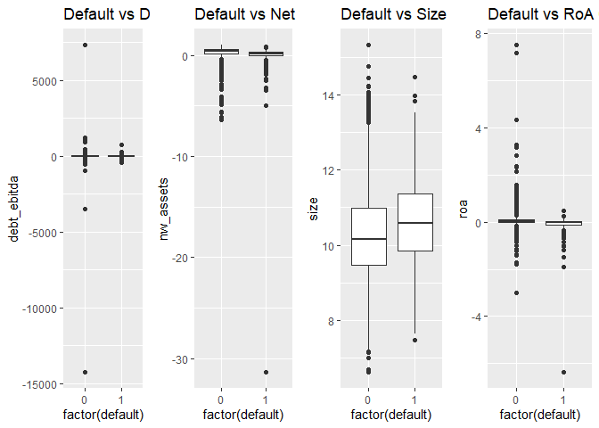

Corporate default study
================
Vicente
2023-06-10

## Corporate default study

This project is centered around analyzing a dataset related to the
financial health of companies. The dataset consists of various financial
and operational variables, providing valuable insights into factors that
may contribute to bankruptcy. By examining these variables and their
relationships, I aim to uncover patterns and indicators that can assist
in predicting the likelihood of a company facing financial distress.

The dataset used in this analysis was collected from reliable
proprietary sources, ensuring data integrity and accuracy. It
encompasses a wide range of features, including liquidity ratios,
profitability measures, debt levels, and other financial metrics. These
variables offer a comprehensive view of a company’s financial position
and performance.

Throughout the analysis, I will address several key questions. What are
the significant predictors of bankruptcy? How do different financial
ratios and indicators impact the likelihood of default? Can we build a
predictive model to forecast bankruptcy risk accurately? By exploring
these questions, I aim to provide valuable insights and actionable
recommendations to stakeholders, such as investors, financial
institutions, and business analysts.

To analyze the dataset, I employ various statistical and machine
learning techniques. This includes exploratory data analysis, feature
selection, logistic regression, decision tree models, and ensemble
methods. Additionally, I utilize data visualization tools to present
findings in a clear and intuitive manner, facilitating better
understanding and decision-making.

Some of key accomplishments and capabilities:

Data Cleaning and Manipulation: Using powerful R packages such as
tidyverse, dplyr, and purrr, I proficiently cleaned a complex dataset,
effectively handling missing and infinite values, and identifying and
removing duplicate entries. These steps ensured a clean and accurate
dataset, which is the foundation of any data analysis project.

Data Visualization: I have a knack for turning raw data into insightful
visualizations. Utilizing the ggplot2 and gridExtra libraries, I created
various plots including histograms, bar plots, and box plots to
understand the distribution of different variables. Furthermore, I
generated a correlation plot, which helped to visualize the
relationships between different variables.

Statistical Analysis: I computed descriptive statistics and identified
correlations among variables, skillfully dealing with highly correlated
variables to avoid multicollinearity in my predictive models.

Predictive Modeling: I showcased my expertise in model building by using
logistic regression and machine learning techniques with glm,
randomForest, and xgboost libraries. I also implemented cross-validation
for model evaluation and performed a systematic variable selection
process to optimize model performance.

Model Evaluation: I believe in the importance of robust model
evaluation. I calculated the ROC curve and the AUC statistic, widely
recognized metrics for binary classification problems, to evaluate the
performance of my predictive models. This allowed me to ensure that the
models I built were not just statistically significant but also
practically useful.

Domain Knowledge: My deep understanding of financial data was crucial in
this project. I worked with financial data and developed insightful
visualizations and models based on variables such as debt to EBITDA
ratio, net worth/assets, and default status.

Here are descriptions for each variable:

cash_assets: This variable represents the ratio of a company’s cash to
its total assets. It gives an indication of the company’s liquidity and
its ability to cover its short-term liabilities.

debt_ebitda: This variable is the ratio of a company’s debt to its
earnings before interest, taxes, depreciation, and amortization
(EBITDA). It is used to measure a company’s ability to pay off its
incurred debt.

debt_assets: This variable is the ratio of a company’s total debt to its
total assets. It provides a measure of the company’s financial leverage
and risk.

roe: This stands for Return on Equity. It measures the financial
performance of a company by dividing net income by shareholder’s equity.
It indicates how well a company is using its equity to generate profits.

roa: This stands for Return on Assets. It measures how efficiently a
company is using its assets to generate earnings. It’s calculated by
dividing net income by total assets.

intger_debt: Internal cash generation / debt, a measure of a firm’s
ability to service its debt.

size: This variable represents the size of the company in terms of its
total assets.

cap_debt: This variable represents the capital structure of the firm,
specifically the proportion of debt in the company’s capital structure.

nw_assets: This variable represents the ratio of net worth to total
assets. It’s a measure of a company’s financial stability and
efficiency.

liab_assets: This variable represents the ratio of total liabilities to
total assets. It provides an indication of the financial risk of the
company.

intger_netdebt: Internal cash generation / debt, but with net debt
(total debt - cash and cash equivalents) instead of total debt.

int_cov: This variable likely stands for Interest Coverage, which is the
ratio of a company’s EBITDA to its interest expenses. It indicates how
easily a company can pay interest on its outstanding debt.

prftmrgn: This stands for Profit Margin. It measures how much out of
every dollar of sales a company keeps in earnings. It is a measure of
the profitability of the company.

liquidity_ratio: This variable is a measure of a firm’s ability to pay
off its current liabilities with its current assets. It’s a key
indicator of a firm’s financial health.

netdebt_intger: Ratio of net debt to the company’s EBITDA, another
measure of a company’s ability to pay its debts.

intger_debt2: Another measure of a company’s ability to pay its interest
expenses.

cash_currntliab: This variable represents the ratio of a company’s cash
to its current liabilities. It’s a measure of a company’s short-term
liquidity.

default: This binary variable indicates whether the company has
defaulted on its debt or not. A value of 1 would represent a default,
and 0 would represent no default.

## Load packages and data

``` r
# Load packages

library(ggplot2)
library(dplyr)
library(tidyverse)
library(car)
library(boot)
library(rms)
library(mFilter)
library(gam)
library(caret)
library(pROC)
library(DMwR)
library(fmsb)
library(gridExtra)
library(purrr)
library(bestglm)
library(ggcorrplot)
library(randomForest)
library(kernlab)

setwd("C:\\Users\\vicente\\Desktop\\Data Portfolio\\sme")
df <- read_csv("company_bankruptcy_study.csv")
```

## Cleaning Data and removing highly correlated variables

``` r
# Cleaning Data
# Drop rows with NA's
df <- df %>%
  drop_na()

# Remove infinite values
df <- df %>%
  mutate(across(everything(), ~replace(., is.infinite(.), NA)))

# Drop rows with NA's again (this will remove the rows with infinities)
df <- df %>%
  drop_na()

# Duplicated Data
duplicate_rows <- duplicated(df)
print(paste("Number of duplicated records:", sum(duplicate_rows)))
```

    ## [1] "Number of duplicated records: 0"

``` r
# Now let's get summary statistics
summary <- df %>%
  summary()

print(summary)
```

    ##   cash_assets        debt_ebitda          debt_assets      
    ##  Min.   :0.000000   Min.   :-14224.000   Min.   :0.000007  
    ##  1st Qu.:0.009448   1st Qu.:     0.195   1st Qu.:0.073735  
    ##  Median :0.027551   Median :     1.013   Median :0.189434  
    ##  Mean   :0.061705   Mean   :     0.625   Mean   :0.234238  
    ##  3rd Qu.:0.076146   3rd Qu.:     2.645   3rd Qu.:0.342434  
    ##  Max.   :0.827090   Max.   :  7323.750   Max.   :5.081729  
    ##       roe                  roa            intger_debt             size       
    ##  Min.   :-196.53571   Min.   :-6.35314   Min.   :-6586.500   Min.   : 6.623  
    ##  1st Qu.:   0.02509   1st Qu.: 0.00146   1st Qu.:    0.137   1st Qu.: 9.484  
    ##  Median :   0.14970   Median : 0.03937   Median :    0.520   Median :10.185  
    ##  Mean   :   0.21539   Mean   : 0.05698   Mean   :   16.311   Mean   :10.287  
    ##  3rd Qu.:   0.33376   3rd Qu.: 0.10897   3rd Qu.:    1.827   3rd Qu.:11.017  
    ##  Max.   : 183.87500   Max.   : 7.49872   Max.   :13540.000   Max.   :15.326  
    ##     cap_debt           nw_assets        netdebt_assets      liab_assets      
    ##  Min.   :-162.6000   Min.   :-31.3002   Min.   :-0.82331   Min.   : 0.02231  
    ##  1st Qu.:   0.1224   1st Qu.:  0.1570   1st Qu.: 0.02213   1st Qu.: 0.44803  
    ##  Median :   0.3326   Median :  0.3487   Median : 0.14340   Median : 0.65130  
    ##  Mean   :   0.4309   Mean   :  0.3199   Mean   : 0.17253   Mean   : 0.68007  
    ##  3rd Qu.:   0.6040   3rd Qu.:  0.5520   3rd Qu.: 0.30105   3rd Qu.: 0.84295  
    ##  Max.   : 247.5556   Max.   :  0.9777   Max.   : 5.06758   Max.   :32.30018  
    ##  intger_netdebt        int_cov             prftmrgn         
    ##  Min.   :-910.200   Min.   : -999.990   Min.   :-12.283020  
    ##  1st Qu.:  -0.170   1st Qu.:    0.800   1st Qu.:  0.000917  
    ##  Median :   0.270   Median :    2.050   Median :  0.020083  
    ##  Mean   :   2.875   Mean   :    9.523   Mean   :  0.019285  
    ##  3rd Qu.:   1.077   3rd Qu.:    5.400   3rd Qu.:  0.063898  
    ##  Max.   :7244.667   Max.   :  999.990   Max.   :  1.858268  
    ##   debt_intger        liquidity_ratio  gencap_stdebt       gencap_stdebt_assets
    ##  Min.   :-3177.000   Min.   : 0.010   Min.   :-5605.500   Min.   :-5.74251    
    ##  1st Qu.:    0.165   1st Qu.: 0.920   1st Qu.:    0.367   1st Qu.:-0.11965    
    ##  Median :    1.019   Median : 1.260   Median :    1.291   Median : 0.02898    
    ##  Mean   :    2.793   Mean   : 1.664   Mean   :   44.746   Mean   : 0.04737    
    ##  3rd Qu.:    3.242   3rd Qu.: 1.900   3rd Qu.:    5.242   3rd Qu.: 0.18833    
    ##  Max.   : 4191.833   Max.   :44.360   Max.   :22341.000   Max.   : 9.38267    
    ##  netdebt_intger       intger_debt2        cash_currntliab       default       
    ##  Min.   :-3161.000   Min.   :-1050.0000   Min.   : 0.00000   Min.   :0.00000  
    ##  1st Qu.:   -0.159   1st Qu.:    0.1252   1st Qu.: 0.02271   1st Qu.:0.00000  
    ##  Median :    0.661   Median :    0.3904   Median : 0.06671   Median :0.00000  
    ##  Mean   :    2.283   Mean   :    0.5202   Mean   : 0.22426   Mean   :0.05263  
    ##  3rd Qu.:    2.731   3rd Qu.:    0.8076   3rd Qu.: 0.19620   3rd Qu.:0.00000  
    ##  Max.   : 3985.000   Max.   :  933.9459   Max.   :10.29964   Max.   :1.00000

``` r
# Find highly correlated variables
correlation_matrix <- cor(df)
highly_correlated <- findCorrelation(correlation_matrix, cutoff = 0.75)

# Get the names of the highly correlated variables
highly_correlated_names <- colnames(df)[highly_correlated]

# Print out the names
print(highly_correlated_names)
```

    ## [1] "gencap_stdebt_assets" "netdebt_assets"       "nw_assets"           
    ## [4] "gencap_stdebt"        "debt_intger"

``` r
# Remove highly correlated columns
df <- df[c(-10,-11,-15,-17,-18)]
```

## Check for outliers

``` r
# The identification of outliers can be done in several ways, but a common method is to identify values that are too far from the mean or median of the distribution. One common rule is to consider as outliers any value that is further than 1.5 times the interquartile range (IQR) from the quartiles.

# Function to identify outliers for numeric columns
identify_outliers <- function(x) {
  if(is.numeric(x)) {
    qnt <- quantile(x, probs=c(.25, .75), na.rm = T)
    H <- 1.5 * IQR(x, na.rm = T)
    return(sum(x < qnt[1] - H | x > qnt[2] + H, na.rm = TRUE))
  } else {
    return(NA)
  }
}

# Apply function to all columns of df and print the result
sapply(df, identify_outliers)
```

    ##     cash_assets     debt_ebitda     debt_assets             roe             roa 
    ##             704            1203             155            1077             894 
    ##     intger_debt            size        cap_debt       nw_assets  intger_netdebt 
    ##            1292              79             325             211            1897 
    ##         int_cov        prftmrgn liquidity_ratio  netdebt_intger    intger_debt2 
    ##            1114            1326             634            1385             752 
    ## cash_currntliab         default 
    ##             962             430

## Create a correlation plot

``` r
# Create a correlation plot
df %>%
  cor(use = "all.obs") %>%
  ggcorrplot(show.diag = F, type = "lower", lab = TRUE, lab_size=2)
```

<!-- -->

## Generate histograms for each variable

``` r
# List of histograms for each column
hist_list <- map(names(df), function(col) {
  ggplot(df, aes_string(col)) +
    geom_histogram(bins = 50) +
    theme_minimal() +
    ggtitle(col)
})

# Arrange plots in a grid
do.call("grid.arrange", c(hist_list, ncol = 4))
```

<!-- -->

## Plotting distributions of numeric variables

``` r
# Plotting distributions of numeric variables
ggplot(df, aes(x = nw_assets)) + geom_histogram(binwidth = 0.1, fill = "blue", color = "black")
```

<!-- -->

``` r
ggplot(df, aes(x = debt_assets)) + geom_histogram(binwidth = 0.1, fill = "blue", color = "black")
```

<!-- -->

``` r
ggplot(df, aes(x = prftmrgn)) + geom_histogram(binwidth = 0.01, fill = "blue", color = "black")
```

<!-- -->

``` r
# Barplots for categorical variables
ggplot(df, aes(x = default)) + geom_bar(fill = "blue", color = "black")
```

<!-- -->

``` r
# Boxplots for numeric variables by default
ggplot(df, aes(group = default, y = debt_ebitda)) + geom_boxplot()
```

<!-- -->

## Plotting interesting features

``` r
p1 <- ggplot(df, aes(x = factor(default), y = debt_ebitda)) +
  geom_boxplot() +
  labs(title = "Default vs Debt / EBITDA Correlation")

p2 <- ggplot(df, aes(x = factor(default), y = nw_assets)) +
  geom_boxplot() +
  labs(title = "Default vs Net worth/Assets Correlation")

p3 <- ggplot(df, aes(x = factor(default), y = size)) +
  geom_boxplot() +
  labs(title = "Default vs Size Correlation")

p4 <- ggplot(df, aes(x = factor(default), y = roa)) +
  geom_boxplot() +
  labs(title = "Default vs RoA Correlation")

# Arrange plots in a grid
grid.arrange(p1, p2, p3, p4, ncol = 4)
```

<!-- -->

## Fit the logistic regression model with all variables and check Variance Inflation Factors

``` r
# There is some multicollinearity because of cash_assets
model_test <- glm(default ~ ., data = df)
summary(model_test)
```

    ## 
    ## Call:
    ## glm(formula = default ~ ., data = df)
    ## 
    ## Deviance Residuals: 
    ##      Min        1Q    Median        3Q       Max  
    ## -1.10412  -0.06897  -0.04762  -0.02312   1.00550  
    ## 
    ## Coefficients:
    ##                   Estimate Std. Error t value Pr(>|t|)    
    ## (Intercept)     -4.531e-02  2.372e-02  -1.910  0.05616 .  
    ## cash_assets     -1.177e-01  3.969e-02  -2.964  0.00304 ** 
    ## debt_ebitda      3.263e-06  1.312e-05   0.249  0.80356    
    ## debt_assets      6.418e-02  1.251e-02   5.132 2.94e-07 ***
    ## roe             -3.645e-04  5.670e-04  -0.643  0.52042    
    ## roa             -4.560e-02  1.427e-02  -3.194  0.00141 ** 
    ## intger_debt      5.956e-06  9.897e-06   0.602  0.54731    
    ## size             1.066e-02  2.233e-03   4.774 1.84e-06 ***
    ## cap_debt         3.651e-04  5.600e-04   0.652  0.51438    
    ## nw_assets       -3.283e-02  6.019e-03  -5.454 5.08e-08 ***
    ## intger_netdebt  -1.730e-05  2.560e-05  -0.676  0.49919    
    ## int_cov          5.622e-05  4.381e-05   1.283  0.19941    
    ## prftmrgn        -5.528e-02  1.313e-02  -4.209 2.59e-05 ***
    ## liquidity_ratio -4.942e-03  1.874e-03  -2.637  0.00837 ** 
    ## netdebt_intger   4.449e-05  3.025e-05   1.471  0.14141    
    ## intger_debt2    -5.023e-05  1.332e-04  -0.377  0.70611    
    ## cash_currntliab  9.694e-03  7.587e-03   1.278  0.20138    
    ## ---
    ## Signif. codes:  0 '***' 0.001 '**' 0.01 '*' 0.05 '.' 0.1 ' ' 1
    ## 
    ## (Dispersion parameter for gaussian family taken to be 0.04760356)
    ## 
    ##     Null deviance: 407.37  on 8170  degrees of freedom
    ## Residual deviance: 388.16  on 8154  degrees of freedom
    ## AIC: -1672.2
    ## 
    ## Number of Fisher Scoring iterations: 2

``` r
data.frame(vif(model_test))
```

    ##                 vif.model_test.
    ## cash_assets            2.183907
    ## debt_ebitda            1.000628
    ## debt_assets            1.194683
    ## roe                    1.034314
    ## roa                    1.926591
    ## intger_debt            1.037670
    ## size                   1.109375
    ## cap_debt               1.003855
    ## nw_assets              1.801547
    ## intger_netdebt         1.000912
    ## int_cov                1.146827
    ## prftmrgn               1.854671
    ## liquidity_ratio        1.621599
    ## netdebt_intger         1.000910
    ## intger_debt2           1.001225
    ## cash_currntliab        2.805780

## Run various logistic models using 5-fold CV and selecting the best model

``` r
# Define the outcome variable
outcome <- "default"

# Convert the outcome variable to a factor
df[[outcome]] <- as.factor(df[[outcome]])

# Generate valid variable names for factor levels
levels(df[[outcome]]) <- make.names(levels(df[[outcome]]))

# Define the predictor variables and the outcome
variables <- colnames(df[1:16])

data_subset <- df[, c(variables, outcome)]

# Define the control for the train function
ctrl <- trainControl(method = "cv", number = 5, classProbs = TRUE, summaryFunction = twoClassSummary,verboseIter = FALSE)

# Initialize variables to store the best model and the best AUC
best_model <- NULL
best_auc <- 0

# Fit a logistic regression model using stepwise variable selection
model_formula <- as.formula(paste(outcome, "~ ."))

# Fit a logistic regression model using 5-fold CV and compute the AUC
set.seed(123) # for reproducibility
best_logit <- train(model_formula, data = data_subset, method = "glmStepAIC", trControl = ctrl, metric = "ROC", na.action = na.omit)
```

    ## Start:  AIC=2439.66
    ## .outcome ~ cash_assets + debt_ebitda + debt_assets + roe + roa + 
    ##     intger_debt + size + cap_debt + nw_assets + intger_netdebt + 
    ##     int_cov + prftmrgn + liquidity_ratio + netdebt_intger + intger_debt2 + 
    ##     cash_currntliab
    ## 
    ##                   Df Deviance    AIC
    ## - intger_debt      1   2405.7 2437.7
    ## - netdebt_intger   1   2405.8 2437.8
    ## - intger_debt2     1   2405.8 2437.8
    ## - debt_ebitda      1   2405.9 2437.9
    ## - prftmrgn         1   2406.0 2438.0
    ## - roe              1   2406.0 2438.0
    ## - cap_debt         1   2406.1 2438.1
    ## - int_cov          1   2406.4 2438.4
    ## - cash_assets      1   2406.9 2438.9
    ## <none>                 2405.7 2439.7
    ## - cash_currntliab  1   2407.8 2439.8
    ## - intger_netdebt   1   2408.0 2440.0
    ## - debt_assets      1   2410.4 2442.4
    ## - nw_assets        1   2412.8 2444.8
    ## - liquidity_ratio  1   2418.8 2450.8
    ## - size             1   2421.3 2453.3
    ## - roa              1   2431.4 2463.4
    ## 
    ## Step:  AIC=2437.68
    ## .outcome ~ cash_assets + debt_ebitda + debt_assets + roe + roa + 
    ##     size + cap_debt + nw_assets + intger_netdebt + int_cov + 
    ##     prftmrgn + liquidity_ratio + netdebt_intger + intger_debt2 + 
    ##     cash_currntliab
    ## 
    ##                   Df Deviance    AIC
    ## - netdebt_intger   1   2405.8 2435.8
    ## - intger_debt2     1   2405.8 2435.8
    ## - debt_ebitda      1   2405.9 2435.9
    ## - prftmrgn         1   2406.0 2436.0
    ## - roe              1   2406.0 2436.0
    ## - cap_debt         1   2406.1 2436.1
    ## - int_cov          1   2406.4 2436.4
    ## - cash_assets      1   2406.9 2436.9
    ## <none>                 2405.7 2437.7
    ## - cash_currntliab  1   2407.8 2437.8
    ## - intger_netdebt   1   2408.1 2438.1
    ## - debt_assets      1   2410.4 2440.4
    ## - nw_assets        1   2412.8 2442.8
    ## - liquidity_ratio  1   2418.8 2448.8
    ## - size             1   2421.3 2451.3
    ## - roa              1   2431.7 2461.7
    ## 
    ## Step:  AIC=2435.78
    ## .outcome ~ cash_assets + debt_ebitda + debt_assets + roe + roa + 
    ##     size + cap_debt + nw_assets + intger_netdebt + int_cov + 
    ##     prftmrgn + liquidity_ratio + intger_debt2 + cash_currntliab
    ## 
    ##                   Df Deviance    AIC
    ## - intger_debt2     1   2405.9 2433.9
    ## - debt_ebitda      1   2406.0 2434.0
    ## - prftmrgn         1   2406.1 2434.1
    ## - roe              1   2406.1 2434.1
    ## - cap_debt         1   2406.2 2434.2
    ## - int_cov          1   2406.5 2434.5
    ## - cash_assets      1   2407.0 2435.0
    ## <none>                 2405.8 2435.8
    ## - cash_currntliab  1   2407.9 2435.9
    ## - intger_netdebt   1   2408.2 2436.2
    ## - debt_assets      1   2410.5 2438.5
    ## - nw_assets        1   2412.9 2440.9
    ## - liquidity_ratio  1   2418.9 2446.9
    ## - size             1   2421.4 2449.4
    ## - roa              1   2431.8 2459.8
    ## 
    ## Step:  AIC=2433.91
    ## .outcome ~ cash_assets + debt_ebitda + debt_assets + roe + roa + 
    ##     size + cap_debt + nw_assets + intger_netdebt + int_cov + 
    ##     prftmrgn + liquidity_ratio + cash_currntliab
    ## 
    ##                   Df Deviance    AIC
    ## - debt_ebitda      1   2406.1 2432.1
    ## - prftmrgn         1   2406.2 2432.2
    ## - roe              1   2406.3 2432.3
    ## - cap_debt         1   2406.3 2432.3
    ## - int_cov          1   2406.6 2432.6
    ## - cash_assets      1   2407.1 2433.1
    ## <none>                 2405.9 2433.9
    ## - cash_currntliab  1   2408.1 2434.1
    ## - intger_netdebt   1   2408.3 2434.3
    ## - debt_assets      1   2410.6 2436.6
    ## - nw_assets        1   2413.1 2439.1
    ## - liquidity_ratio  1   2419.1 2445.1
    ## - size             1   2421.5 2447.5
    ## - roa              1   2431.9 2457.9
    ## 
    ## Step:  AIC=2432.11
    ## .outcome ~ cash_assets + debt_assets + roe + roa + size + cap_debt + 
    ##     nw_assets + intger_netdebt + int_cov + prftmrgn + liquidity_ratio + 
    ##     cash_currntliab
    ## 
    ##                   Df Deviance    AIC
    ## - prftmrgn         1   2406.4 2430.4
    ## - roe              1   2406.5 2430.5
    ## - cap_debt         1   2406.5 2430.5
    ## - int_cov          1   2406.8 2430.8
    ## - cash_assets      1   2407.3 2431.3
    ## <none>                 2406.1 2432.1
    ## - cash_currntliab  1   2408.3 2432.3
    ## - intger_netdebt   1   2408.5 2432.5
    ## - debt_assets      1   2410.9 2434.9
    ## - nw_assets        1   2413.3 2437.3
    ## - liquidity_ratio  1   2419.3 2443.3
    ## - size             1   2421.7 2445.7
    ## - roa              1   2432.0 2456.0
    ## 
    ## Step:  AIC=2430.44
    ## .outcome ~ cash_assets + debt_assets + roe + roa + size + cap_debt + 
    ##     nw_assets + intger_netdebt + int_cov + liquidity_ratio + 
    ##     cash_currntliab
    ## 
    ##                   Df Deviance    AIC
    ## - roe              1   2406.8 2428.8
    ## - cap_debt         1   2406.8 2428.8
    ## - int_cov          1   2407.1 2429.1
    ## - cash_assets      1   2407.6 2429.6
    ## <none>                 2406.4 2430.4
    ## - cash_currntliab  1   2408.7 2430.7
    ## - intger_netdebt   1   2408.8 2430.8
    ## - debt_assets      1   2411.2 2433.2
    ## - nw_assets        1   2413.5 2435.5
    ## - liquidity_ratio  1   2419.5 2441.5
    ## - size             1   2423.6 2445.6
    ## - roa              1   2444.2 2466.2
    ## 
    ## Step:  AIC=2428.78
    ## .outcome ~ cash_assets + debt_assets + roa + size + cap_debt + 
    ##     nw_assets + intger_netdebt + int_cov + liquidity_ratio + 
    ##     cash_currntliab
    ## 
    ##                   Df Deviance    AIC
    ## - cap_debt         1   2407.2 2427.2
    ## - int_cov          1   2407.5 2427.5
    ## - cash_assets      1   2407.9 2427.9
    ## <none>                 2406.8 2428.8
    ## - cash_currntliab  1   2409.1 2429.1
    ## - intger_netdebt   1   2409.2 2429.2
    ## - debt_assets      1   2411.5 2431.5
    ## - nw_assets        1   2413.7 2433.7
    ## - liquidity_ratio  1   2419.8 2439.8
    ## - size             1   2424.2 2444.2
    ## - roa              1   2445.0 2465.0
    ## 
    ## Step:  AIC=2427.17
    ## .outcome ~ cash_assets + debt_assets + roa + size + nw_assets + 
    ##     intger_netdebt + int_cov + liquidity_ratio + cash_currntliab
    ## 
    ##                   Df Deviance    AIC
    ## - int_cov          1   2407.9 2425.9
    ## - cash_assets      1   2408.3 2426.3
    ## <none>                 2407.2 2427.2
    ## - cash_currntliab  1   2409.5 2427.5
    ## - intger_netdebt   1   2409.5 2427.5
    ## - debt_assets      1   2411.7 2429.7
    ## - nw_assets        1   2414.3 2432.3
    ## - liquidity_ratio  1   2420.1 2438.1
    ## - size             1   2424.7 2442.7
    ## - roa              1   2445.1 2463.1
    ## 
    ## Step:  AIC=2425.86
    ## .outcome ~ cash_assets + debt_assets + roa + size + nw_assets + 
    ##     intger_netdebt + liquidity_ratio + cash_currntliab
    ## 
    ##                   Df Deviance    AIC
    ## - cash_assets      1   2409.0 2425.0
    ## <none>                 2407.9 2425.9
    ## - cash_currntliab  1   2410.2 2426.2
    ## - intger_netdebt   1   2410.3 2426.3
    ## - debt_assets      1   2412.3 2428.3
    ## - nw_assets        1   2415.0 2431.0
    ## - liquidity_ratio  1   2421.2 2437.2
    ## - size             1   2425.3 2441.3
    ## - roa              1   2447.8 2463.8
    ## 
    ## Step:  AIC=2425
    ## .outcome ~ debt_assets + roa + size + nw_assets + intger_netdebt + 
    ##     liquidity_ratio + cash_currntliab
    ## 
    ##                   Df Deviance    AIC
    ## <none>                 2409.0 2425.0
    ## - intger_netdebt   1   2411.4 2425.4
    ## - debt_assets      1   2413.4 2427.4
    ## - nw_assets        1   2415.8 2429.8
    ## - liquidity_ratio  1   2421.2 2435.2
    ## - cash_currntliab  1   2425.1 2439.1
    ## - size             1   2430.0 2444.0
    ## - roa              1   2449.6 2463.6
    ## Start:  AIC=2399.14
    ## .outcome ~ cash_assets + debt_ebitda + debt_assets + roe + roa + 
    ##     intger_debt + size + cap_debt + nw_assets + intger_netdebt + 
    ##     int_cov + prftmrgn + liquidity_ratio + netdebt_intger + intger_debt2 + 
    ##     cash_currntliab
    ## 
    ##                   Df Deviance    AIC
    ## - debt_ebitda      1   2365.1 2397.1
    ## - intger_debt      1   2365.2 2397.2
    ## - int_cov          1   2365.2 2397.2
    ## - intger_debt2     1   2365.3 2397.3
    ## - cash_currntliab  1   2365.4 2397.4
    ## - cap_debt         1   2366.2 2398.2
    ## - prftmrgn         1   2366.6 2398.6
    ## <none>                 2365.1 2399.1
    ## - netdebt_intger   1   2367.6 2399.6
    ## - intger_netdebt   1   2367.8 2399.8
    ## - debt_assets      1   2368.2 2400.2
    ## - nw_assets        1   2368.6 2400.6
    ## - cash_assets      1   2368.9 2400.9
    ## - roe              1   2370.0 2402.0
    ## - size             1   2375.0 2407.0
    ## - roa              1   2391.0 2423.0
    ## - liquidity_ratio  1   2407.1 2439.1
    ## 
    ## Step:  AIC=2397.14
    ## .outcome ~ cash_assets + debt_assets + roe + roa + intger_debt + 
    ##     size + cap_debt + nw_assets + intger_netdebt + int_cov + 
    ##     prftmrgn + liquidity_ratio + netdebt_intger + intger_debt2 + 
    ##     cash_currntliab
    ## 
    ##                   Df Deviance    AIC
    ## - intger_debt      1   2365.2 2395.2
    ## - int_cov          1   2365.2 2395.2
    ## - intger_debt2     1   2365.3 2395.3
    ## - cash_currntliab  1   2365.4 2395.4
    ## - cap_debt         1   2366.2 2396.2
    ## - prftmrgn         1   2366.6 2396.6
    ## <none>                 2365.1 2397.1
    ## - netdebt_intger   1   2367.6 2397.6
    ## - intger_netdebt   1   2367.8 2397.8
    ## - debt_assets      1   2368.2 2398.2
    ## - nw_assets        1   2368.6 2398.6
    ## - cash_assets      1   2368.9 2398.9
    ## - roe              1   2370.0 2400.0
    ## - size             1   2375.0 2405.0
    ## - roa              1   2391.0 2421.0
    ## - liquidity_ratio  1   2407.1 2437.1
    ## 
    ## Step:  AIC=2395.16
    ## .outcome ~ cash_assets + debt_assets + roe + roa + size + cap_debt + 
    ##     nw_assets + intger_netdebt + int_cov + prftmrgn + liquidity_ratio + 
    ##     netdebt_intger + intger_debt2 + cash_currntliab
    ## 
    ##                   Df Deviance    AIC
    ## - int_cov          1   2365.2 2393.2
    ## - intger_debt2     1   2365.4 2393.4
    ## - cash_currntliab  1   2365.4 2393.4
    ## - cap_debt         1   2366.3 2394.3
    ## - prftmrgn         1   2366.6 2394.6
    ## <none>                 2365.2 2395.2
    ## - netdebt_intger   1   2367.6 2395.6
    ## - intger_netdebt   1   2367.9 2395.9
    ## - debt_assets      1   2368.2 2396.2
    ## - nw_assets        1   2368.6 2396.6
    ## - cash_assets      1   2368.9 2396.9
    ## - roe              1   2370.0 2398.0
    ## - size             1   2375.0 2403.0
    ## - roa              1   2391.2 2419.2
    ## - liquidity_ratio  1   2407.1 2435.1
    ## 
    ## Step:  AIC=2393.24
    ## .outcome ~ cash_assets + debt_assets + roe + roa + size + cap_debt + 
    ##     nw_assets + intger_netdebt + prftmrgn + liquidity_ratio + 
    ##     netdebt_intger + intger_debt2 + cash_currntliab
    ## 
    ##                   Df Deviance    AIC
    ## - intger_debt2     1   2365.4 2391.4
    ## - cash_currntliab  1   2365.5 2391.5
    ## - cap_debt         1   2366.4 2392.4
    ## - prftmrgn         1   2366.7 2392.7
    ## <none>                 2365.2 2393.2
    ## - netdebt_intger   1   2367.7 2393.7
    ## - intger_netdebt   1   2367.9 2393.9
    ## - debt_assets      1   2368.3 2394.3
    ## - nw_assets        1   2368.7 2394.7
    ## - cash_assets      1   2369.1 2395.1
    ## - roe              1   2370.1 2396.1
    ## - size             1   2375.1 2401.1
    ## - roa              1   2391.3 2417.3
    ## - liquidity_ratio  1   2407.1 2433.1
    ## 
    ## Step:  AIC=2391.44
    ## .outcome ~ cash_assets + debt_assets + roe + roa + size + cap_debt + 
    ##     nw_assets + intger_netdebt + prftmrgn + liquidity_ratio + 
    ##     netdebt_intger + cash_currntliab
    ## 
    ##                   Df Deviance    AIC
    ## - cash_currntliab  1   2365.7 2389.7
    ## - cap_debt         1   2366.6 2390.6
    ## - prftmrgn         1   2366.9 2390.9
    ## <none>                 2365.4 2391.4
    ## - netdebt_intger   1   2367.9 2391.9
    ## - intger_netdebt   1   2368.1 2392.1
    ## - debt_assets      1   2368.6 2392.6
    ## - nw_assets        1   2368.9 2392.9
    ## - cash_assets      1   2369.2 2393.2
    ## - roe              1   2370.3 2394.3
    ## - size             1   2375.3 2399.3
    ## - roa              1   2391.5 2415.5
    ## - liquidity_ratio  1   2407.2 2431.2
    ## 
    ## Step:  AIC=2389.72
    ## .outcome ~ cash_assets + debt_assets + roe + roa + size + cap_debt + 
    ##     nw_assets + intger_netdebt + prftmrgn + liquidity_ratio + 
    ##     netdebt_intger
    ## 
    ##                   Df Deviance    AIC
    ## - cap_debt         1   2366.9 2388.9
    ## - prftmrgn         1   2367.2 2389.2
    ## <none>                 2365.7 2389.7
    ## - netdebt_intger   1   2368.2 2390.2
    ## - intger_netdebt   1   2368.4 2390.4
    ## - debt_assets      1   2368.9 2390.9
    ## - nw_assets        1   2369.3 2391.3
    ## - roe              1   2370.6 2392.6
    ## - size             1   2375.3 2397.3
    ## - cash_assets      1   2379.8 2401.8
    ## - roa              1   2391.9 2413.9
    ## - liquidity_ratio  1   2416.6 2438.6
    ## 
    ## Step:  AIC=2388.87
    ## .outcome ~ cash_assets + debt_assets + roe + roa + size + nw_assets + 
    ##     intger_netdebt + prftmrgn + liquidity_ratio + netdebt_intger
    ## 
    ##                   Df Deviance    AIC
    ## - prftmrgn         1   2368.4 2388.4
    ## <none>                 2366.9 2388.9
    ## - netdebt_intger   1   2369.3 2389.3
    ## - intger_netdebt   1   2369.6 2389.6
    ## - debt_assets      1   2370.2 2390.2
    ## - nw_assets        1   2370.4 2390.4
    ## - roe              1   2371.8 2391.8
    ## - size             1   2376.5 2396.5
    ## - cash_assets      1   2381.2 2401.2
    ## - roa              1   2392.9 2412.9
    ## - liquidity_ratio  1   2418.3 2438.3
    ## 
    ## Step:  AIC=2388.4
    ## .outcome ~ cash_assets + debt_assets + roe + roa + size + nw_assets + 
    ##     intger_netdebt + liquidity_ratio + netdebt_intger
    ## 
    ##                   Df Deviance    AIC
    ## <none>                 2368.4 2388.4
    ## - netdebt_intger   1   2370.8 2388.8
    ## - intger_netdebt   1   2371.1 2389.1
    ## - nw_assets        1   2371.7 2389.7
    ## - debt_assets      1   2371.8 2389.8
    ## - roe              1   2373.2 2391.2
    ## - size             1   2380.2 2398.2
    ## - cash_assets      1   2383.1 2401.1
    ## - roa              1   2411.4 2429.4
    ## - liquidity_ratio  1   2419.8 2437.8
    ## Start:  AIC=2427.37
    ## .outcome ~ cash_assets + debt_ebitda + debt_assets + roe + roa + 
    ##     intger_debt + size + cap_debt + nw_assets + intger_netdebt + 
    ##     int_cov + prftmrgn + liquidity_ratio + netdebt_intger + intger_debt2 + 
    ##     cash_currntliab
    ## 
    ##                   Df Deviance    AIC
    ## - int_cov          1   2393.4 2425.4
    ## - intger_debt      1   2393.4 2425.4
    ## - cash_assets      1   2393.4 2425.4
    ## - roe              1   2393.4 2425.4
    ## - cap_debt         1   2393.4 2425.4
    ## - intger_debt2     1   2393.5 2425.5
    ## - debt_ebitda      1   2393.5 2425.5
    ## - prftmrgn         1   2393.7 2425.7
    ## - netdebt_intger   1   2394.8 2426.8
    ## - intger_netdebt   1   2394.8 2426.8
    ## <none>                 2393.4 2427.4
    ## - debt_assets      1   2396.0 2428.0
    ## - nw_assets        1   2396.6 2428.6
    ## - cash_currntliab  1   2401.7 2433.7
    ## - liquidity_ratio  1   2408.3 2440.3
    ## - size             1   2411.7 2443.7
    ## - roa              1   2428.8 2460.8
    ## 
    ## Step:  AIC=2425.37
    ## .outcome ~ cash_assets + debt_ebitda + debt_assets + roe + roa + 
    ##     intger_debt + size + cap_debt + nw_assets + intger_netdebt + 
    ##     prftmrgn + liquidity_ratio + netdebt_intger + intger_debt2 + 
    ##     cash_currntliab
    ## 
    ##                   Df Deviance    AIC
    ## - intger_debt      1   2393.4 2423.4
    ## - cash_assets      1   2393.4 2423.4
    ## - roe              1   2393.4 2423.4
    ## - cap_debt         1   2393.4 2423.4
    ## - intger_debt2     1   2393.5 2423.5
    ## - debt_ebitda      1   2393.5 2423.5
    ## - prftmrgn         1   2393.7 2423.7
    ## - netdebt_intger   1   2394.8 2424.8
    ## - intger_netdebt   1   2394.8 2424.8
    ## <none>                 2393.4 2425.4
    ## - debt_assets      1   2396.0 2426.0
    ## - nw_assets        1   2396.6 2426.6
    ## - cash_currntliab  1   2401.7 2431.7
    ## - liquidity_ratio  1   2408.3 2438.3
    ## - size             1   2411.7 2441.7
    ## - roa              1   2429.4 2459.4
    ## 
    ## Step:  AIC=2423.37
    ## .outcome ~ cash_assets + debt_ebitda + debt_assets + roe + roa + 
    ##     size + cap_debt + nw_assets + intger_netdebt + prftmrgn + 
    ##     liquidity_ratio + netdebt_intger + intger_debt2 + cash_currntliab
    ## 
    ##                   Df Deviance    AIC
    ## - cash_assets      1   2393.4 2421.4
    ## - roe              1   2393.4 2421.4
    ## - cap_debt         1   2393.4 2421.4
    ## - intger_debt2     1   2393.5 2421.5
    ## - debt_ebitda      1   2393.5 2421.5
    ## - prftmrgn         1   2393.7 2421.7
    ## - netdebt_intger   1   2394.8 2422.8
    ## - intger_netdebt   1   2394.8 2422.8
    ## <none>                 2393.4 2423.4
    ## - debt_assets      1   2396.0 2424.0
    ## - nw_assets        1   2396.6 2424.6
    ## - cash_currntliab  1   2401.7 2429.7
    ## - liquidity_ratio  1   2408.3 2436.3
    ## - size             1   2411.7 2439.7
    ## - roa              1   2429.6 2457.6
    ## 
    ## Step:  AIC=2421.39
    ## .outcome ~ debt_ebitda + debt_assets + roe + roa + size + cap_debt + 
    ##     nw_assets + intger_netdebt + prftmrgn + liquidity_ratio + 
    ##     netdebt_intger + intger_debt2 + cash_currntliab
    ## 
    ##                   Df Deviance    AIC
    ## - roe              1   2393.4 2419.4
    ## - cap_debt         1   2393.4 2419.4
    ## - intger_debt2     1   2393.5 2419.5
    ## - debt_ebitda      1   2393.5 2419.5
    ## - prftmrgn         1   2393.7 2419.7
    ## - netdebt_intger   1   2394.8 2420.8
    ## - intger_netdebt   1   2394.9 2420.9
    ## <none>                 2393.4 2421.4
    ## - debt_assets      1   2396.1 2422.1
    ## - nw_assets        1   2396.7 2422.7
    ## - liquidity_ratio  1   2409.3 2435.3
    ## - size             1   2412.7 2438.7
    ## - cash_currntliab  1   2415.6 2441.6
    ## - roa              1   2429.8 2455.8
    ## 
    ## Step:  AIC=2419.44
    ## .outcome ~ debt_ebitda + debt_assets + roa + size + cap_debt + 
    ##     nw_assets + intger_netdebt + prftmrgn + liquidity_ratio + 
    ##     netdebt_intger + intger_debt2 + cash_currntliab
    ## 
    ##                   Df Deviance    AIC
    ## - cap_debt         1   2393.5 2417.5
    ## - debt_ebitda      1   2393.6 2417.6
    ## - intger_debt2     1   2393.6 2417.6
    ## - prftmrgn         1   2393.8 2417.8
    ## - netdebt_intger   1   2394.9 2418.9
    ## - intger_netdebt   1   2394.9 2418.9
    ## <none>                 2393.4 2419.4
    ## - debt_assets      1   2396.1 2420.1
    ## - nw_assets        1   2396.7 2420.7
    ## - liquidity_ratio  1   2409.3 2433.3
    ## - size             1   2412.8 2436.8
    ## - cash_currntliab  1   2415.6 2439.6
    ## - roa              1   2430.0 2454.0
    ## 
    ## Step:  AIC=2417.51
    ## .outcome ~ debt_ebitda + debt_assets + roa + size + nw_assets + 
    ##     intger_netdebt + prftmrgn + liquidity_ratio + netdebt_intger + 
    ##     intger_debt2 + cash_currntliab
    ## 
    ##                   Df Deviance    AIC
    ## - debt_ebitda      1   2393.6 2415.6
    ## - intger_debt2     1   2393.7 2415.7
    ## - prftmrgn         1   2393.8 2415.8
    ## - netdebt_intger   1   2394.9 2416.9
    ## - intger_netdebt   1   2395.0 2417.0
    ## <none>                 2393.5 2417.5
    ## - debt_assets      1   2396.2 2418.2
    ## - nw_assets        1   2396.8 2418.8
    ## - liquidity_ratio  1   2409.4 2431.4
    ## - size             1   2412.9 2434.9
    ## - cash_currntliab  1   2415.7 2437.7
    ## - roa              1   2430.1 2452.1
    ## 
    ## Step:  AIC=2415.63
    ## .outcome ~ debt_assets + roa + size + nw_assets + intger_netdebt + 
    ##     prftmrgn + liquidity_ratio + netdebt_intger + intger_debt2 + 
    ##     cash_currntliab
    ## 
    ##                   Df Deviance    AIC
    ## - intger_debt2     1   2393.8 2413.8
    ## - prftmrgn         1   2394.0 2414.0
    ## - netdebt_intger   1   2395.1 2415.1
    ## - intger_netdebt   1   2395.1 2415.1
    ## <none>                 2393.6 2415.6
    ## - debt_assets      1   2396.4 2416.4
    ## - nw_assets        1   2396.9 2416.9
    ## - liquidity_ratio  1   2409.6 2429.6
    ## - size             1   2413.0 2433.0
    ## - cash_currntliab  1   2415.8 2435.8
    ## - roa              1   2430.1 2450.1
    ## 
    ## Step:  AIC=2413.77
    ## .outcome ~ debt_assets + roa + size + nw_assets + intger_netdebt + 
    ##     prftmrgn + liquidity_ratio + netdebt_intger + cash_currntliab
    ## 
    ##                   Df Deviance    AIC
    ## - prftmrgn         1   2394.1 2412.1
    ## - netdebt_intger   1   2395.2 2413.2
    ## - intger_netdebt   1   2395.2 2413.2
    ## <none>                 2393.8 2413.8
    ## - debt_assets      1   2396.6 2414.6
    ## - nw_assets        1   2397.0 2415.0
    ## - liquidity_ratio  1   2409.7 2427.7
    ## - size             1   2413.1 2431.1
    ## - cash_currntliab  1   2416.1 2434.1
    ## - roa              1   2430.2 2448.2
    ## 
    ## Step:  AIC=2412.11
    ## .outcome ~ debt_assets + roa + size + nw_assets + intger_netdebt + 
    ##     liquidity_ratio + netdebt_intger + cash_currntliab
    ## 
    ##                   Df Deviance    AIC
    ## - netdebt_intger   1   2395.5 2411.5
    ## - intger_netdebt   1   2395.6 2411.6
    ## <none>                 2394.1 2412.1
    ## - debt_assets      1   2396.9 2412.9
    ## - nw_assets        1   2397.2 2413.2
    ## - liquidity_ratio  1   2410.1 2426.1
    ## - size             1   2415.4 2431.4
    ## - cash_currntliab  1   2416.6 2432.6
    ## - roa              1   2445.2 2461.2
    ## 
    ## Step:  AIC=2411.54
    ## .outcome ~ debt_assets + roa + size + nw_assets + intger_netdebt + 
    ##     liquidity_ratio + cash_currntliab
    ## 
    ##                   Df Deviance    AIC
    ## - intger_netdebt   1   2397.0 2411.0
    ## <none>                 2395.5 2411.5
    ## - debt_assets      1   2398.5 2412.5
    ## - nw_assets        1   2398.6 2412.6
    ## - liquidity_ratio  1   2411.5 2425.5
    ## - size             1   2416.6 2430.6
    ## - cash_currntliab  1   2418.2 2432.2
    ## - roa              1   2446.5 2460.5
    ## 
    ## Step:  AIC=2411
    ## .outcome ~ debt_assets + roa + size + nw_assets + liquidity_ratio + 
    ##     cash_currntliab
    ## 
    ##                   Df Deviance    AIC
    ## <none>                 2397.0 2411.0
    ## - debt_assets      1   2400.0 2412.0
    ## - nw_assets        1   2400.3 2412.3
    ## - liquidity_ratio  1   2413.0 2425.0
    ## - size             1   2418.2 2430.2
    ## - cash_currntliab  1   2419.8 2431.8
    ## - roa              1   2447.5 2459.5
    ## Start:  AIC=2438.92
    ## .outcome ~ cash_assets + debt_ebitda + debt_assets + roe + roa + 
    ##     intger_debt + size + cap_debt + nw_assets + intger_netdebt + 
    ##     int_cov + prftmrgn + liquidity_ratio + netdebt_intger + intger_debt2 + 
    ##     cash_currntliab
    ## 
    ##                   Df Deviance    AIC
    ## - int_cov          1   2404.9 2436.9
    ## - cap_debt         1   2405.0 2437.0
    ## - intger_debt      1   2405.0 2437.0
    ## - debt_ebitda      1   2405.2 2437.2
    ## - intger_debt2     1   2405.3 2437.3
    ## - roe              1   2405.5 2437.5
    ## - prftmrgn         1   2405.5 2437.5
    ## - cash_currntliab  1   2406.4 2438.4
    ## <none>                 2404.9 2438.9
    ## - netdebt_intger   1   2407.0 2439.0
    ## - cash_assets      1   2407.1 2439.1
    ## - intger_netdebt   1   2407.2 2439.2
    ## - debt_assets      1   2411.0 2443.0
    ## - nw_assets        1   2411.8 2443.8
    ## - liquidity_ratio  1   2420.3 2452.3
    ## - roa              1   2427.3 2459.3
    ## - size             1   2428.2 2460.2
    ## 
    ## Step:  AIC=2436.92
    ## .outcome ~ cash_assets + debt_ebitda + debt_assets + roe + roa + 
    ##     intger_debt + size + cap_debt + nw_assets + intger_netdebt + 
    ##     prftmrgn + liquidity_ratio + netdebt_intger + intger_debt2 + 
    ##     cash_currntliab
    ## 
    ##                   Df Deviance    AIC
    ## - cap_debt         1   2405.0 2435.0
    ## - intger_debt      1   2405.0 2435.0
    ## - debt_ebitda      1   2405.2 2435.2
    ## - intger_debt2     1   2405.3 2435.3
    ## - roe              1   2405.5 2435.5
    ## - prftmrgn         1   2405.5 2435.5
    ## - cash_currntliab  1   2406.4 2436.4
    ## <none>                 2404.9 2436.9
    ## - netdebt_intger   1   2407.0 2437.0
    ## - cash_assets      1   2407.1 2437.1
    ## - intger_netdebt   1   2407.2 2437.2
    ## - debt_assets      1   2411.0 2441.0
    ## - nw_assets        1   2411.8 2441.8
    ## - liquidity_ratio  1   2420.4 2450.4
    ## - roa              1   2427.8 2457.8
    ## - size             1   2428.2 2458.2
    ## 
    ## Step:  AIC=2435
    ## .outcome ~ cash_assets + debt_ebitda + debt_assets + roe + roa + 
    ##     intger_debt + size + nw_assets + intger_netdebt + prftmrgn + 
    ##     liquidity_ratio + netdebt_intger + intger_debt2 + cash_currntliab
    ## 
    ##                   Df Deviance    AIC
    ## - intger_debt      1   2405.1 2433.1
    ## - debt_ebitda      1   2405.3 2433.3
    ## - intger_debt2     1   2405.4 2433.4
    ## - roe              1   2405.6 2433.6
    ## - prftmrgn         1   2405.6 2433.6
    ## - cash_currntliab  1   2406.5 2434.5
    ## <none>                 2405.0 2435.0
    ## - netdebt_intger   1   2407.1 2435.1
    ## - cash_assets      1   2407.2 2435.2
    ## - intger_netdebt   1   2407.2 2435.2
    ## - debt_assets      1   2411.1 2439.1
    ## - nw_assets        1   2411.9 2439.9
    ## - liquidity_ratio  1   2420.6 2448.6
    ## - roa              1   2427.9 2455.9
    ## - size             1   2428.2 2456.2
    ## 
    ## Step:  AIC=2433.1
    ## .outcome ~ cash_assets + debt_ebitda + debt_assets + roe + roa + 
    ##     size + nw_assets + intger_netdebt + prftmrgn + liquidity_ratio + 
    ##     netdebt_intger + intger_debt2 + cash_currntliab
    ## 
    ##                   Df Deviance    AIC
    ## - debt_ebitda      1   2405.4 2431.4
    ## - intger_debt2     1   2405.5 2431.5
    ## - roe              1   2405.7 2431.7
    ## - prftmrgn         1   2405.7 2431.7
    ## - cash_currntliab  1   2406.6 2432.6
    ## <none>                 2405.1 2433.1
    ## - netdebt_intger   1   2407.2 2433.2
    ## - cash_assets      1   2407.3 2433.3
    ## - intger_netdebt   1   2407.3 2433.3
    ## - debt_assets      1   2411.2 2437.2
    ## - nw_assets        1   2412.0 2438.0
    ## - liquidity_ratio  1   2420.6 2446.6
    ## - roa              1   2428.2 2454.2
    ## - size             1   2428.3 2454.3
    ## 
    ## Step:  AIC=2431.36
    ## .outcome ~ cash_assets + debt_assets + roe + roa + size + nw_assets + 
    ##     intger_netdebt + prftmrgn + liquidity_ratio + netdebt_intger + 
    ##     intger_debt2 + cash_currntliab
    ## 
    ##                   Df Deviance    AIC
    ## - intger_debt2     1   2405.7 2429.7
    ## - roe              1   2405.9 2429.9
    ## - prftmrgn         1   2405.9 2429.9
    ## - cash_currntliab  1   2406.8 2430.8
    ## <none>                 2405.4 2431.4
    ## - netdebt_intger   1   2407.5 2431.5
    ## - cash_assets      1   2407.6 2431.6
    ## - intger_netdebt   1   2407.6 2431.6
    ## - debt_assets      1   2411.5 2435.5
    ## - nw_assets        1   2412.2 2436.2
    ## - liquidity_ratio  1   2420.9 2444.9
    ## - roa              1   2428.4 2452.4
    ## - size             1   2428.6 2452.6
    ## 
    ## Step:  AIC=2429.72
    ## .outcome ~ cash_assets + debt_assets + roe + roa + size + nw_assets + 
    ##     intger_netdebt + prftmrgn + liquidity_ratio + netdebt_intger + 
    ##     cash_currntliab
    ## 
    ##                   Df Deviance    AIC
    ## - roe              1   2406.3 2428.3
    ## - prftmrgn         1   2406.3 2428.3
    ## - cash_currntliab  1   2407.2 2429.2
    ## <none>                 2405.7 2429.7
    ## - netdebt_intger   1   2407.8 2429.8
    ## - cash_assets      1   2407.9 2429.9
    ## - intger_netdebt   1   2407.9 2429.9
    ## - debt_assets      1   2411.9 2433.9
    ## - nw_assets        1   2412.6 2434.6
    ## - liquidity_ratio  1   2421.2 2443.2
    ## - roa              1   2428.8 2450.8
    ## - size             1   2428.9 2450.9
    ## 
    ## Step:  AIC=2428.3
    ## .outcome ~ cash_assets + debt_assets + roa + size + nw_assets + 
    ##     intger_netdebt + prftmrgn + liquidity_ratio + netdebt_intger + 
    ##     cash_currntliab
    ## 
    ##                   Df Deviance    AIC
    ## - prftmrgn         1   2406.9 2426.9
    ## - cash_currntliab  1   2407.8 2427.8
    ## <none>                 2406.3 2428.3
    ## - netdebt_intger   1   2408.4 2428.4
    ## - cash_assets      1   2408.5 2428.5
    ## - intger_netdebt   1   2408.5 2428.5
    ## - debt_assets      1   2412.4 2432.4
    ## - nw_assets        1   2413.3 2433.3
    ## - liquidity_ratio  1   2421.9 2441.9
    ## - roa              1   2429.1 2449.1
    ## - size             1   2429.3 2449.3
    ## 
    ## Step:  AIC=2426.9
    ## .outcome ~ cash_assets + debt_assets + roa + size + nw_assets + 
    ##     intger_netdebt + liquidity_ratio + netdebt_intger + cash_currntliab
    ## 
    ##                   Df Deviance    AIC
    ## - cash_currntliab  1   2408.4 2426.4
    ## <none>                 2406.9 2426.9
    ## - netdebt_intger   1   2409.0 2427.0
    ## - intger_netdebt   1   2409.1 2427.1
    ## - cash_assets      1   2409.2 2427.2
    ## - debt_assets      1   2412.9 2430.9
    ## - nw_assets        1   2413.7 2431.7
    ## - liquidity_ratio  1   2422.4 2440.4
    ## - size             1   2432.6 2450.6
    ## - roa              1   2441.2 2459.2
    ## 
    ## Step:  AIC=2426.42
    ## .outcome ~ cash_assets + debt_assets + roa + size + nw_assets + 
    ##     intger_netdebt + liquidity_ratio + netdebt_intger
    ## 
    ##                   Df Deviance    AIC
    ## <none>                 2408.4 2426.4
    ## - netdebt_intger   1   2410.5 2426.5
    ## - intger_netdebt   1   2410.7 2426.7
    ## - debt_assets      1   2414.7 2430.7
    ## - nw_assets        1   2415.5 2431.5
    ## - cash_assets      1   2424.6 2440.6
    ## - liquidity_ratio  1   2431.1 2447.1
    ## - size             1   2432.6 2448.6
    ## - roa              1   2442.8 2458.8
    ## Start:  AIC=2434.79
    ## .outcome ~ cash_assets + debt_ebitda + debt_assets + roe + roa + 
    ##     intger_debt + size + cap_debt + nw_assets + intger_netdebt + 
    ##     int_cov + prftmrgn + liquidity_ratio + netdebt_intger + intger_debt2 + 
    ##     cash_currntliab
    ## 
    ##                   Df Deviance    AIC
    ## - int_cov          1   2400.8 2432.8
    ## - debt_ebitda      1   2400.9 2432.9
    ## - cap_debt         1   2400.9 2432.9
    ## - intger_debt2     1   2401.0 2433.0
    ## - intger_debt      1   2401.0 2433.0
    ## - roe              1   2401.3 2433.3
    ## - netdebt_intger   1   2402.3 2434.3
    ## - cash_assets      1   2402.4 2434.4
    ## - prftmrgn         1   2402.7 2434.7
    ## <none>                 2400.8 2434.8
    ## - cash_currntliab  1   2403.5 2435.5
    ## - intger_netdebt   1   2404.1 2436.1
    ## - nw_assets        1   2406.7 2438.7
    ## - debt_assets      1   2407.7 2439.7
    ## - size             1   2415.0 2447.0
    ## - liquidity_ratio  1   2416.0 2448.0
    ## - roa              1   2419.2 2451.2
    ## 
    ## Step:  AIC=2432.79
    ## .outcome ~ cash_assets + debt_ebitda + debt_assets + roe + roa + 
    ##     intger_debt + size + cap_debt + nw_assets + intger_netdebt + 
    ##     prftmrgn + liquidity_ratio + netdebt_intger + intger_debt2 + 
    ##     cash_currntliab
    ## 
    ##                   Df Deviance    AIC
    ## - debt_ebitda      1   2400.9 2430.9
    ## - cap_debt         1   2400.9 2430.9
    ## - intger_debt2     1   2401.0 2431.0
    ## - intger_debt      1   2401.0 2431.0
    ## - roe              1   2401.3 2431.3
    ## - netdebt_intger   1   2402.3 2432.3
    ## - cash_assets      1   2402.4 2432.4
    ## - prftmrgn         1   2402.7 2432.7
    ## <none>                 2400.8 2432.8
    ## - cash_currntliab  1   2403.5 2433.5
    ## - intger_netdebt   1   2404.1 2434.1
    ## - nw_assets        1   2406.7 2436.7
    ## - debt_assets      1   2407.7 2437.7
    ## - size             1   2415.1 2445.1
    ## - liquidity_ratio  1   2416.1 2446.1
    ## - roa              1   2419.5 2449.5
    ## 
    ## Step:  AIC=2430.86
    ## .outcome ~ cash_assets + debt_assets + roe + roa + intger_debt + 
    ##     size + cap_debt + nw_assets + intger_netdebt + prftmrgn + 
    ##     liquidity_ratio + netdebt_intger + intger_debt2 + cash_currntliab
    ## 
    ##                   Df Deviance    AIC
    ## - cap_debt         1   2401.0 2429.0
    ## - intger_debt2     1   2401.0 2429.0
    ## - intger_debt      1   2401.1 2429.1
    ## - roe              1   2401.4 2429.4
    ## - netdebt_intger   1   2402.3 2430.3
    ## - cash_assets      1   2402.4 2430.4
    ## - prftmrgn         1   2402.8 2430.8
    ## <none>                 2400.9 2430.9
    ## - cash_currntliab  1   2403.6 2431.6
    ## - intger_netdebt   1   2404.2 2432.2
    ## - nw_assets        1   2406.8 2434.8
    ## - debt_assets      1   2407.8 2435.8
    ## - size             1   2415.1 2443.1
    ## - liquidity_ratio  1   2416.2 2444.2
    ## - roa              1   2419.6 2447.6
    ## 
    ## Step:  AIC=2428.96
    ## .outcome ~ cash_assets + debt_assets + roe + roa + intger_debt + 
    ##     size + nw_assets + intger_netdebt + prftmrgn + liquidity_ratio + 
    ##     netdebt_intger + intger_debt2 + cash_currntliab
    ## 
    ##                   Df Deviance    AIC
    ## - intger_debt2     1   2401.1 2427.1
    ## - intger_debt      1   2401.2 2427.2
    ## - roe              1   2401.5 2427.5
    ## - netdebt_intger   1   2402.4 2428.4
    ## - cash_assets      1   2402.6 2428.6
    ## - prftmrgn         1   2402.9 2428.9
    ## <none>                 2401.0 2429.0
    ## - cash_currntliab  1   2403.6 2429.6
    ## - intger_netdebt   1   2404.3 2430.3
    ## - nw_assets        1   2406.8 2432.8
    ## - debt_assets      1   2408.0 2434.0
    ## - size             1   2415.2 2441.2
    ## - liquidity_ratio  1   2416.4 2442.4
    ## - roa              1   2419.7 2445.7
    ## 
    ## Step:  AIC=2427.14
    ## .outcome ~ cash_assets + debt_assets + roe + roa + intger_debt + 
    ##     size + nw_assets + intger_netdebt + prftmrgn + liquidity_ratio + 
    ##     netdebt_intger + cash_currntliab
    ## 
    ##                   Df Deviance    AIC
    ## - intger_debt      1   2401.4 2425.4
    ## - roe              1   2401.7 2425.7
    ## - netdebt_intger   1   2402.6 2426.6
    ## - cash_assets      1   2402.7 2426.7
    ## - prftmrgn         1   2403.1 2427.1
    ## <none>                 2401.1 2427.1
    ## - cash_currntliab  1   2403.8 2427.8
    ## - intger_netdebt   1   2404.5 2428.5
    ## - nw_assets        1   2407.0 2431.0
    ## - debt_assets      1   2408.2 2432.2
    ## - size             1   2415.3 2439.3
    ## - liquidity_ratio  1   2416.6 2440.6
    ## - roa              1   2419.9 2443.9
    ## 
    ## Step:  AIC=2425.4
    ## .outcome ~ cash_assets + debt_assets + roe + roa + size + nw_assets + 
    ##     intger_netdebt + prftmrgn + liquidity_ratio + netdebt_intger + 
    ##     cash_currntliab
    ## 
    ##                   Df Deviance    AIC
    ## - roe              1   2401.9 2423.9
    ## - netdebt_intger   1   2402.9 2424.9
    ## - cash_assets      1   2403.0 2425.0
    ## - prftmrgn         1   2403.3 2425.3
    ## <none>                 2401.4 2425.4
    ## - cash_currntliab  1   2404.1 2426.1
    ## - intger_netdebt   1   2404.7 2426.7
    ## - nw_assets        1   2407.2 2429.2
    ## - debt_assets      1   2408.4 2430.4
    ## - size             1   2415.7 2437.7
    ## - liquidity_ratio  1   2416.9 2438.9
    ## - roa              1   2420.6 2442.6
    ## 
    ## Step:  AIC=2423.93
    ## .outcome ~ cash_assets + debt_assets + roa + size + nw_assets + 
    ##     intger_netdebt + prftmrgn + liquidity_ratio + netdebt_intger + 
    ##     cash_currntliab
    ## 
    ##                   Df Deviance    AIC
    ## - netdebt_intger   1   2403.4 2423.4
    ## - cash_assets      1   2403.5 2423.5
    ## - prftmrgn         1   2403.8 2423.8
    ## <none>                 2401.9 2423.9
    ## - cash_currntliab  1   2404.7 2424.7
    ## - intger_netdebt   1   2405.2 2425.2
    ## - nw_assets        1   2407.6 2427.6
    ## - debt_assets      1   2408.9 2428.9
    ## - size             1   2416.5 2436.5
    ## - liquidity_ratio  1   2417.4 2437.4
    ## - roa              1   2421.5 2441.5
    ## 
    ## Step:  AIC=2423.42
    ## .outcome ~ cash_assets + debt_assets + roa + size + nw_assets + 
    ##     intger_netdebt + prftmrgn + liquidity_ratio + cash_currntliab
    ## 
    ##                   Df Deviance    AIC
    ## - cash_assets      1   2405.0 2423.0
    ## - prftmrgn         1   2405.3 2423.3
    ## <none>                 2403.4 2423.4
    ## - cash_currntliab  1   2406.2 2424.2
    ## - intger_netdebt   1   2406.7 2424.7
    ## - nw_assets        1   2409.1 2427.1
    ## - debt_assets      1   2410.6 2428.6
    ## - size             1   2417.8 2435.8
    ## - liquidity_ratio  1   2418.8 2436.8
    ## - roa              1   2423.0 2441.0
    ## 
    ## Step:  AIC=2422.99
    ## .outcome ~ debt_assets + roa + size + nw_assets + intger_netdebt + 
    ##     prftmrgn + liquidity_ratio + cash_currntliab
    ## 
    ##                   Df Deviance    AIC
    ## <none>                 2405.0 2423.0
    ## - prftmrgn         1   2407.0 2423.0
    ## - intger_netdebt   1   2408.3 2424.3
    ## - nw_assets        1   2410.3 2426.3
    ## - debt_assets      1   2411.8 2427.8
    ## - liquidity_ratio  1   2419.1 2435.1
    ## - size             1   2423.2 2439.2
    ## - cash_currntliab  1   2424.2 2440.2
    ## - roa              1   2424.3 2440.3
    ## Start:  AIC=3032.04
    ## .outcome ~ cash_assets + debt_ebitda + debt_assets + roe + roa + 
    ##     intger_debt + size + cap_debt + nw_assets + intger_netdebt + 
    ##     int_cov + prftmrgn + liquidity_ratio + netdebt_intger + intger_debt2 + 
    ##     cash_currntliab
    ## 
    ##                   Df Deviance    AIC
    ## - int_cov          1   2998.1 3030.1
    ## - intger_debt      1   2998.1 3030.1
    ## - cap_debt         1   2998.1 3030.1
    ## - debt_ebitda      1   2998.2 3030.2
    ## - intger_debt2     1   2998.3 3030.3
    ## - roe              1   2998.6 3030.6
    ## - prftmrgn         1   2999.0 3031.0
    ## - netdebt_intger   1   2999.5 3031.5
    ## - cash_assets      1   2999.8 3031.8
    ## <none>                 2998.0 3032.0
    ## - intger_netdebt   1   3000.9 3032.9
    ## - cash_currntliab  1   3000.9 3032.9
    ## - debt_assets      1   3003.8 3035.8
    ## - nw_assets        1   3004.6 3036.6
    ## - size             1   3018.2 3050.2
    ## - liquidity_ratio  1   3021.9 3053.9
    ## - roa              1   3030.4 3062.4
    ## 
    ## Step:  AIC=3030.06
    ## .outcome ~ cash_assets + debt_ebitda + debt_assets + roe + roa + 
    ##     intger_debt + size + cap_debt + nw_assets + intger_netdebt + 
    ##     prftmrgn + liquidity_ratio + netdebt_intger + intger_debt2 + 
    ##     cash_currntliab
    ## 
    ##                   Df Deviance    AIC
    ## - intger_debt      1   2998.1 3028.1
    ## - cap_debt         1   2998.2 3028.2
    ## - debt_ebitda      1   2998.2 3028.2
    ## - intger_debt2     1   2998.3 3028.3
    ## - roe              1   2998.6 3028.6
    ## - prftmrgn         1   2999.1 3029.1
    ## - netdebt_intger   1   2999.6 3029.6
    ## - cash_assets      1   2999.8 3029.8
    ## <none>                 2998.1 3030.1
    ## - intger_netdebt   1   3001.0 3031.0
    ## - cash_currntliab  1   3001.0 3031.0
    ## - debt_assets      1   3003.8 3033.8
    ## - nw_assets        1   3004.6 3034.6
    ## - size             1   3018.2 3048.2
    ## - liquidity_ratio  1   3022.0 3052.0
    ## - roa              1   3031.1 3061.1
    ## 
    ## Step:  AIC=3028.12
    ## .outcome ~ cash_assets + debt_ebitda + debt_assets + roe + roa + 
    ##     size + cap_debt + nw_assets + intger_netdebt + prftmrgn + 
    ##     liquidity_ratio + netdebt_intger + intger_debt2 + cash_currntliab
    ## 
    ##                   Df Deviance    AIC
    ## - cap_debt         1   2998.2 3026.2
    ## - debt_ebitda      1   2998.3 3026.3
    ## - intger_debt2     1   2998.4 3026.4
    ## - roe              1   2998.7 3026.7
    ## - prftmrgn         1   2999.1 3027.1
    ## - netdebt_intger   1   2999.6 3027.6
    ## - cash_assets      1   2999.9 3027.9
    ## <none>                 2998.1 3028.1
    ## - intger_netdebt   1   3001.0 3029.0
    ## - cash_currntliab  1   3001.1 3029.1
    ## - debt_assets      1   3003.8 3031.8
    ## - nw_assets        1   3004.6 3032.6
    ## - size             1   3018.2 3046.2
    ## - liquidity_ratio  1   3022.1 3050.1
    ## - roa              1   3031.5 3059.5
    ## 
    ## Step:  AIC=3026.21
    ## .outcome ~ cash_assets + debt_ebitda + debt_assets + roe + roa + 
    ##     size + nw_assets + intger_netdebt + prftmrgn + liquidity_ratio + 
    ##     netdebt_intger + intger_debt2 + cash_currntliab
    ## 
    ##                   Df Deviance    AIC
    ## - debt_ebitda      1   2998.3 3024.3
    ## - intger_debt2     1   2998.5 3024.5
    ## - roe              1   2998.8 3024.8
    ## - prftmrgn         1   2999.2 3025.2
    ## - netdebt_intger   1   2999.7 3025.7
    ## - cash_assets      1   3000.0 3026.0
    ## <none>                 2998.2 3026.2
    ## - intger_netdebt   1   3001.1 3027.1
    ## - cash_currntliab  1   3001.1 3027.1
    ## - debt_assets      1   3004.0 3030.0
    ## - nw_assets        1   3004.7 3030.7
    ## - size             1   3018.3 3044.3
    ## - liquidity_ratio  1   3022.3 3048.3
    ## - roa              1   3031.6 3057.6
    ## 
    ## Step:  AIC=3024.35
    ## .outcome ~ cash_assets + debt_assets + roe + roa + size + nw_assets + 
    ##     intger_netdebt + prftmrgn + liquidity_ratio + netdebt_intger + 
    ##     intger_debt2 + cash_currntliab
    ## 
    ##                   Df Deviance    AIC
    ## - intger_debt2     1   2998.6 3022.6
    ## - roe              1   2998.9 3022.9
    ## - prftmrgn         1   2999.3 3023.3
    ## - netdebt_intger   1   2999.8 3023.8
    ## - cash_assets      1   3000.1 3024.1
    ## <none>                 2998.3 3024.3
    ## - intger_netdebt   1   3001.2 3025.2
    ## - cash_currntliab  1   3001.2 3025.2
    ## - debt_assets      1   3004.2 3028.2
    ## - nw_assets        1   3004.8 3028.8
    ## - size             1   3018.4 3042.4
    ## - liquidity_ratio  1   3022.4 3046.4
    ## - roa              1   3031.7 3055.7
    ## 
    ## Step:  AIC=3022.6
    ## .outcome ~ cash_assets + debt_assets + roe + roa + size + nw_assets + 
    ##     intger_netdebt + prftmrgn + liquidity_ratio + netdebt_intger + 
    ##     cash_currntliab
    ## 
    ##                   Df Deviance    AIC
    ## - roe              1   2999.2 3021.2
    ## - prftmrgn         1   2999.6 3021.6
    ## - netdebt_intger   1   3000.1 3022.1
    ## - cash_assets      1   3000.3 3022.3
    ## <none>                 2998.6 3022.6
    ## - intger_netdebt   1   3001.5 3023.5
    ## - cash_currntliab  1   3001.5 3023.5
    ## - debt_assets      1   3004.4 3026.4
    ## - nw_assets        1   3005.1 3027.1
    ## - size             1   3018.6 3040.6
    ## - liquidity_ratio  1   3022.6 3044.6
    ## - roa              1   3031.9 3053.9
    ## 
    ## Step:  AIC=3021.19
    ## .outcome ~ cash_assets + debt_assets + roa + size + nw_assets + 
    ##     intger_netdebt + prftmrgn + liquidity_ratio + netdebt_intger + 
    ##     cash_currntliab
    ## 
    ##                   Df Deviance    AIC
    ## - prftmrgn         1   3000.2 3020.2
    ## - netdebt_intger   1   3000.7 3020.7
    ## - cash_assets      1   3000.9 3020.9
    ## <none>                 2999.2 3021.2
    ## - intger_netdebt   1   3002.1 3022.1
    ## - cash_currntliab  1   3002.2 3022.2
    ## - debt_assets      1   3005.0 3025.0
    ## - nw_assets        1   3005.5 3025.5
    ## - size             1   3019.5 3039.5
    ## - liquidity_ratio  1   3023.2 3043.2
    ## - roa              1   3033.1 3053.1
    ## 
    ## Step:  AIC=3020.16
    ## .outcome ~ cash_assets + debt_assets + roa + size + nw_assets + 
    ##     intger_netdebt + liquidity_ratio + netdebt_intger + cash_currntliab
    ## 
    ##                   Df Deviance    AIC
    ## - netdebt_intger   1   3001.7 3019.7
    ## - cash_assets      1   3001.9 3019.9
    ## <none>                 3000.2 3020.2
    ## - intger_netdebt   1   3003.0 3021.0
    ## - cash_currntliab  1   3003.2 3021.2
    ## - debt_assets      1   3006.0 3024.0
    ## - nw_assets        1   3006.2 3024.2
    ## - size             1   3023.2 3041.2
    ## - liquidity_ratio  1   3024.1 3042.1
    ## - roa              1   3053.1 3071.1
    ## 
    ## Step:  AIC=3019.65
    ## .outcome ~ cash_assets + debt_assets + roa + size + nw_assets + 
    ##     intger_netdebt + liquidity_ratio + cash_currntliab
    ## 
    ##                   Df Deviance    AIC
    ## - cash_assets      1   3003.4 3019.4
    ## <none>                 3001.7 3019.7
    ## - intger_netdebt   1   3004.5 3020.5
    ## - cash_currntliab  1   3004.7 3020.7
    ## - debt_assets      1   3007.6 3023.6
    ## - nw_assets        1   3007.7 3023.7
    ## - size             1   3024.6 3040.6
    ## - liquidity_ratio  1   3025.5 3041.5
    ## - roa              1   3054.4 3070.4
    ## 
    ## Step:  AIC=3019.41
    ## .outcome ~ debt_assets + roa + size + nw_assets + intger_netdebt + 
    ##     liquidity_ratio + cash_currntliab
    ## 
    ##                   Df Deviance    AIC
    ## <none>                 3003.4 3019.4
    ## - intger_netdebt   1   3006.3 3020.3
    ## - nw_assets        1   3009.0 3023.0
    ## - debt_assets      1   3009.1 3023.1
    ## - cash_currntliab  1   3024.5 3038.5
    ## - liquidity_ratio  1   3025.6 3039.6
    ## - size             1   3031.8 3045.8
    ## - roa              1   3056.2 3070.2

``` r
# Print the model
print(best_logit)
```

    ## Generalized Linear Model with Stepwise Feature Selection 
    ## 
    ## 8171 samples
    ##   16 predictor
    ##    2 classes: 'X0', 'X1' 
    ## 
    ## No pre-processing
    ## Resampling: Cross-Validated (5 fold) 
    ## Summary of sample sizes: 6537, 6537, 6536, 6537, 6537 
    ## Resampling results:
    ## 
    ##   ROC        Sens       Spec      
    ##   0.7645241  0.9970288  0.02093023

``` r
summary(best_logit)
```

    ## 
    ## Call:
    ## NULL
    ## 
    ## Deviance Residuals: 
    ##     Min       1Q   Median       3Q      Max  
    ## -3.0028  -0.3558  -0.2807  -0.1903   4.4262  
    ## 
    ## Coefficients:
    ##                  Estimate Std. Error z value Pr(>|z|)    
    ## (Intercept)     -4.739734   0.479834  -9.878  < 2e-16 ***
    ## debt_assets      0.484899   0.207203   2.340 0.019273 *  
    ## roa             -2.230508   0.306934  -7.267 3.67e-13 ***
    ## size             0.233551   0.043491   5.370 7.87e-08 ***
    ## nw_assets       -0.252753   0.103697  -2.437 0.014792 *  
    ## intger_netdebt  -0.002971   0.001658  -1.792 0.073208 .  
    ## liquidity_ratio -0.370726   0.086479  -4.287 1.81e-05 ***
    ## cash_currntliab -1.696101   0.438920  -3.864 0.000111 ***
    ## ---
    ## Signif. codes:  0 '***' 0.001 '**' 0.01 '*' 0.05 '.' 0.1 ' ' 1
    ## 
    ## (Dispersion parameter for binomial family taken to be 1)
    ## 
    ##     Null deviance: 3369.3  on 8170  degrees of freedom
    ## Residual deviance: 3003.4  on 8163  degrees of freedom
    ## AIC: 3019.4
    ## 
    ## Number of Fisher Scoring iterations: 8

## ROC analysis and AUROC of Logit model

``` r
#The Area Under the Receiver Operating Characteristic curve (AUROC) is a performance metric for binary classification problems. It measures the trade-off between sensitivity (true positive rate) and specificity (false positive rate) for every possible cutoff. An AUROC of 0.5 is no better than random guessing, while an AUROC of 1.0 signifies a perfect classifier. In general, an AUROC above 0.7 is considered acceptable, while an AUROC above 0.8 is considered good, and an AUROC above 0.9 is considered excellent. However, the acceptability of an AUROC value can depend on the specific application and the cost trade-off between false positives and false negatives. It's important to note that a high AUROC doesn't necessarily imply a useful model, especially if the positive class is very rare, or if the cost of a false positive is high.


# Make predictions on the validation set
pred <- predict(best_logit, newdata = data_subset, type = "prob")

# Compute the ROC curve
roc_obj <- pROC::roc(response = as.numeric(data_subset[[outcome]] == "X1"), predictor = pred[, "X1"])
# Compute the ROC curve
roc_obj <- pROC::roc(response = as.numeric(data_subset[[outcome]] == "X1"), predictor = pred[, "X1"])

# Convert the roc object to a data frame
roc_df <- data.frame(FPR = 1 - roc_obj$specificities, TPR = roc_obj$sensitivities)

# Create the ROC plot
ggplot(data = roc_df, aes(x = FPR, y = TPR)) +
  geom_line(color = "blue") +
  geom_abline(intercept = 0, slope = 1, linetype = "dashed", color = "gray") +
  ggtitle("ROC curve") +
  labs(x = "False Positive Rate", y = "True Positive Rate") +
  theme_minimal() +
  annotate("text", x = 0.6, y = 0.4, label = paste("AUC =", round(auc(roc_obj), 2)))
```

<!-- -->

## Now let’s run some ML models to see if they can improve performance (Random Forest, Neural Net, SVM)

``` r
# Define the control for the train function
ctrl <- trainControl(method = "cv", number = 5, classProbs = TRUE, summaryFunction = twoClassSummary)

# Define the model formula
model_formula <- as.formula(paste(outcome, "~ ."))

# Define a list of models to fit
models <- c("rf", "nnet", "svmLinear")

# Initialize a list to store the models
model_list <- list()

# Fit all models using 5-fold CV
for (model in models) {
  set.seed(123) # for reproducibility
  suppressWarnings({model_list[[model]] <- train(model_formula, data = data_subset, method = model, trControl = ctrl, metric = "ROC", na.action = na.omit)})
}
```

    ## # weights:  19
    ## initial  value 7269.765453 
    ## iter  10 value 1549.640744
    ## iter  20 value 1263.526103
    ## iter  30 value 1234.024552
    ## iter  40 value 1219.333463
    ## iter  50 value 1207.300604
    ## iter  60 value 1191.563417
    ## iter  70 value 1188.549469
    ## iter  80 value 1171.702900
    ## iter  90 value 1166.699335
    ## iter 100 value 1152.112819
    ## final  value 1152.112819 
    ## stopped after 100 iterations
    ## # weights:  55
    ## initial  value 6181.370647 
    ## iter  10 value 1355.862055
    ## iter  20 value 1243.866735
    ## iter  30 value 1208.034303
    ## iter  40 value 1193.715581
    ## iter  50 value 1190.758110
    ## iter  60 value 1188.199030
    ## iter  70 value 1181.053553
    ## iter  80 value 1179.318192
    ## iter  90 value 1178.807088
    ## iter 100 value 1177.163186
    ## final  value 1177.163186 
    ## stopped after 100 iterations
    ## # weights:  91
    ## initial  value 4131.625814 
    ## iter  10 value 1237.962679
    ## iter  20 value 1201.033644
    ## iter  30 value 1169.727487
    ## iter  40 value 1152.561342
    ## iter  50 value 1143.064762
    ## iter  60 value 1131.761210
    ## iter  70 value 1116.110031
    ## iter  80 value 1106.863245
    ## iter  90 value 1092.809360
    ## iter 100 value 1078.760490
    ## final  value 1078.760490 
    ## stopped after 100 iterations
    ## # weights:  19
    ## initial  value 7212.727186 
    ## iter  10 value 1873.170625
    ## iter  20 value 1283.140101
    ## iter  30 value 1244.000365
    ## iter  40 value 1213.978113
    ## iter  50 value 1196.521768
    ## iter  60 value 1182.870745
    ## iter  70 value 1157.149521
    ## iter  80 value 1152.753842
    ## iter  90 value 1150.683891
    ## iter 100 value 1150.115228
    ## final  value 1150.115228 
    ## stopped after 100 iterations
    ## # weights:  55
    ## initial  value 5008.070805 
    ## iter  10 value 1364.541684
    ## iter  20 value 1255.751155
    ## iter  30 value 1216.299971
    ## iter  40 value 1198.696978
    ## iter  50 value 1167.412005
    ## iter  60 value 1143.055707
    ## iter  70 value 1131.564879
    ## iter  80 value 1126.519294
    ## iter  90 value 1122.829638
    ## iter 100 value 1121.842897
    ## final  value 1121.842897 
    ## stopped after 100 iterations
    ## # weights:  91
    ## initial  value 4371.159533 
    ## iter  10 value 1330.213387
    ## iter  20 value 1309.680386
    ## iter  30 value 1254.854352
    ## iter  40 value 1245.845347
    ## iter  50 value 1228.756925
    ## iter  60 value 1200.971655
    ## iter  70 value 1173.827209
    ## iter  80 value 1161.906658
    ## iter  90 value 1152.668692
    ## iter 100 value 1144.679285
    ## final  value 1144.679285 
    ## stopped after 100 iterations
    ## # weights:  19
    ## initial  value 5973.210800 
    ## iter  10 value 1356.641228
    ## iter  20 value 1346.858483
    ## iter  30 value 1346.850131
    ## iter  40 value 1340.034536
    ## iter  50 value 1337.052085
    ## iter  60 value 1336.890807
    ## iter  70 value 1336.386800
    ## iter  80 value 1335.823100
    ## iter  90 value 1334.347535
    ## iter 100 value 1333.846318
    ## final  value 1333.846318 
    ## stopped after 100 iterations
    ## # weights:  55
    ## initial  value 7156.468448 
    ## iter  10 value 1355.969786
    ## iter  20 value 1335.336200
    ## iter  30 value 1333.900347
    ## iter  40 value 1332.254258
    ## iter  50 value 1330.791890
    ## iter  60 value 1329.520422
    ## iter  70 value 1322.997791
    ## iter  80 value 1309.436780
    ## iter  90 value 1304.945588
    ## iter 100 value 1301.201578
    ## final  value 1301.201578 
    ## stopped after 100 iterations
    ## # weights:  91
    ## initial  value 5817.190817 
    ## iter  10 value 1227.758580
    ## iter  20 value 1198.096893
    ## iter  30 value 1173.891851
    ## iter  40 value 1154.010628
    ## iter  50 value 1136.136209
    ## iter  60 value 1119.596687
    ## iter  70 value 1107.362295
    ## iter  80 value 1102.430456
    ## iter  90 value 1095.250828
    ## iter 100 value 1090.667353
    ## final  value 1090.667353 
    ## stopped after 100 iterations
    ## # weights:  19
    ## initial  value 3343.560212 
    ## iter  10 value 1352.067717
    ## iter  20 value 1291.494208
    ## iter  30 value 1253.025343
    ## iter  40 value 1242.915574
    ## iter  50 value 1241.675208
    ## iter  60 value 1238.258405
    ## iter  70 value 1234.078659
    ## iter  80 value 1213.835590
    ## iter  90 value 1199.450238
    ## iter 100 value 1188.854414
    ## final  value 1188.854414 
    ## stopped after 100 iterations
    ## # weights:  55
    ## initial  value 4627.584176 
    ## iter  10 value 1497.799021
    ## iter  20 value 1281.911775
    ## iter  30 value 1236.041168
    ## iter  40 value 1227.588722
    ## iter  50 value 1222.211805
    ## iter  60 value 1219.126268
    ## iter  70 value 1217.086734
    ## iter  80 value 1214.472715
    ## iter  90 value 1210.888511
    ## iter 100 value 1209.839327
    ## final  value 1209.839327 
    ## stopped after 100 iterations
    ## # weights:  91
    ## initial  value 5514.758573 
    ## iter  10 value 1206.117249
    ## iter  20 value 1170.739212
    ## iter  30 value 1148.677522
    ## iter  40 value 1140.891505
    ## iter  50 value 1128.579294
    ## iter  60 value 1111.240718
    ## iter  70 value 1094.246628
    ## iter  80 value 1086.093943
    ## iter  90 value 1070.635892
    ## iter 100 value 1058.175397
    ## final  value 1058.175397 
    ## stopped after 100 iterations
    ## # weights:  19
    ## initial  value 4464.492993 
    ## iter  10 value 1400.824520
    ## iter  20 value 1362.099933
    ## iter  30 value 1351.666172
    ## iter  40 value 1344.084088
    ## iter  50 value 1343.011861
    ## iter  60 value 1319.887434
    ## iter  70 value 1236.563525
    ## iter  80 value 1203.864412
    ## iter  90 value 1175.762176
    ## iter 100 value 1152.438636
    ## final  value 1152.438636 
    ## stopped after 100 iterations
    ## # weights:  55
    ## initial  value 4389.684056 
    ## iter  10 value 1411.370377
    ## iter  20 value 1313.187603
    ## iter  30 value 1273.018117
    ## iter  40 value 1230.455817
    ## iter  50 value 1201.387181
    ## iter  60 value 1175.516697
    ## iter  70 value 1156.360679
    ## iter  80 value 1149.902813
    ## iter  90 value 1144.917443
    ## iter 100 value 1143.143908
    ## final  value 1143.143908 
    ## stopped after 100 iterations
    ## # weights:  91
    ## initial  value 4503.411115 
    ## iter  10 value 1393.378750
    ## iter  20 value 1348.178115
    ## iter  30 value 1288.371321
    ## iter  40 value 1271.255266
    ## iter  50 value 1191.790814
    ## iter  60 value 1173.868210
    ## iter  70 value 1151.573509
    ## iter  80 value 1146.508272
    ## iter  90 value 1135.829602
    ## iter 100 value 1128.719265
    ## final  value 1128.719265 
    ## stopped after 100 iterations
    ## # weights:  19
    ## initial  value 4202.087559 
    ## iter  10 value 1312.741346
    ## iter  20 value 1251.504156
    ## iter  30 value 1229.201853
    ## iter  40 value 1226.797828
    ## iter  50 value 1223.930631
    ## iter  60 value 1222.003316
    ## iter  70 value 1219.528892
    ## iter  80 value 1218.220679
    ## iter  90 value 1210.449423
    ## iter 100 value 1208.808600
    ## final  value 1208.808600 
    ## stopped after 100 iterations
    ## # weights:  55
    ## initial  value 7434.188009 
    ## iter  10 value 1383.349745
    ## iter  20 value 1344.245420
    ## iter  30 value 1335.807025
    ## iter  40 value 1327.900127
    ## iter  50 value 1325.308797
    ## iter  60 value 1322.310768
    ## iter  70 value 1321.106082
    ## iter  80 value 1320.690424
    ## iter  90 value 1320.098684
    ## iter 100 value 1319.420483
    ## final  value 1319.420483 
    ## stopped after 100 iterations
    ## # weights:  91
    ## initial  value 4637.925043 
    ## iter  10 value 1202.848351
    ## iter  20 value 1169.836797
    ## iter  30 value 1148.295648
    ## iter  40 value 1116.659287
    ## iter  50 value 1097.119157
    ## iter  60 value 1086.001823
    ## iter  70 value 1075.840882
    ## iter  80 value 1069.693058
    ## iter  90 value 1059.178637
    ## iter 100 value 1052.666406
    ## final  value 1052.666406 
    ## stopped after 100 iterations
    ## # weights:  19
    ## initial  value 4828.307046 
    ## iter  10 value 1330.865813
    ## iter  20 value 1269.592662
    ## iter  30 value 1236.294363
    ## iter  40 value 1210.388471
    ## iter  50 value 1199.971384
    ## iter  60 value 1181.256514
    ## iter  70 value 1172.709062
    ## iter  80 value 1156.527047
    ## iter  90 value 1150.902048
    ## iter 100 value 1147.885108
    ## final  value 1147.885108 
    ## stopped after 100 iterations
    ## # weights:  55
    ## initial  value 2175.117383 
    ## iter  10 value 1272.679304
    ## iter  20 value 1225.651652
    ## iter  30 value 1202.205045
    ## iter  40 value 1190.292559
    ## iter  50 value 1185.692607
    ## iter  60 value 1176.120963
    ## iter  70 value 1161.483077
    ## iter  80 value 1157.099677
    ## iter  90 value 1153.285503
    ## iter 100 value 1144.956709
    ## final  value 1144.956709 
    ## stopped after 100 iterations
    ## # weights:  91
    ## initial  value 6378.866184 
    ## iter  10 value 1560.304213
    ## iter  20 value 1378.260934
    ## iter  30 value 1238.842926
    ## iter  40 value 1223.740024
    ## iter  50 value 1203.705369
    ## iter  60 value 1190.857278
    ## iter  70 value 1162.360744
    ## iter  80 value 1155.794250
    ## iter  90 value 1149.761843
    ## iter 100 value 1146.613884
    ## final  value 1146.613884 
    ## stopped after 100 iterations
    ## # weights:  19
    ## initial  value 4020.385678 
    ## iter  10 value 1345.060503
    ## iter  20 value 1341.737368
    ## iter  30 value 1287.236403
    ## iter  40 value 1232.644863
    ## iter  50 value 1208.602559
    ## iter  60 value 1194.190099
    ## iter  70 value 1184.433002
    ## iter  80 value 1159.387001
    ## iter  90 value 1156.052801
    ## iter 100 value 1152.929356
    ## final  value 1152.929356 
    ## stopped after 100 iterations
    ## # weights:  55
    ## initial  value 2690.395104 
    ## iter  10 value 1297.945239
    ## iter  20 value 1283.197559
    ## iter  30 value 1278.002504
    ## iter  40 value 1266.133259
    ## iter  50 value 1253.739460
    ## iter  60 value 1211.791104
    ## iter  70 value 1204.273590
    ## iter  80 value 1183.149619
    ## iter  90 value 1168.165708
    ## iter 100 value 1156.736921
    ## final  value 1156.736921 
    ## stopped after 100 iterations
    ## # weights:  91
    ## initial  value 6606.523719 
    ## iter  10 value 1216.089311
    ## iter  20 value 1198.418519
    ## iter  30 value 1183.123762
    ## iter  40 value 1172.286181
    ## iter  50 value 1159.328474
    ## iter  60 value 1144.701964
    ## iter  70 value 1138.768673
    ## iter  80 value 1132.348257
    ## iter  90 value 1128.105737
    ## iter 100 value 1123.439463
    ## final  value 1123.439463 
    ## stopped after 100 iterations
    ## # weights:  19
    ## initial  value 5867.187923 
    ## iter  10 value 1371.204588
    ## iter  20 value 1318.001693
    ## iter  30 value 1277.690264
    ## iter  40 value 1275.463760
    ## iter  50 value 1270.240224
    ## iter  60 value 1249.379714
    ## iter  70 value 1233.198039
    ## iter  80 value 1211.985154
    ## iter  90 value 1208.319808
    ## iter 100 value 1204.183391
    ## final  value 1204.183391 
    ## stopped after 100 iterations
    ## # weights:  55
    ## initial  value 7963.542260 
    ## iter  10 value 1312.570019
    ## iter  20 value 1249.238328
    ## iter  30 value 1210.356404
    ## iter  40 value 1189.728959
    ## iter  50 value 1176.150072
    ## iter  60 value 1165.283792
    ## iter  70 value 1156.498986
    ## iter  80 value 1151.411904
    ## iter  90 value 1150.342393
    ## iter 100 value 1146.585679
    ## final  value 1146.585679 
    ## stopped after 100 iterations
    ## # weights:  91
    ## initial  value 7942.563987 
    ## iter  10 value 1411.340354
    ## iter  20 value 1305.300056
    ## iter  30 value 1281.832332
    ## iter  40 value 1274.519521
    ## iter  50 value 1266.691923
    ## iter  60 value 1245.777423
    ## iter  70 value 1223.938766
    ## iter  80 value 1214.774428
    ## iter  90 value 1210.378494
    ## iter 100 value 1209.865060
    ## final  value 1209.865060 
    ## stopped after 100 iterations
    ## # weights:  19
    ## initial  value 2381.696551 
    ## iter  10 value 1318.505375
    ## iter  20 value 1303.366476
    ## iter  30 value 1287.812275
    ## iter  40 value 1282.078704
    ## iter  50 value 1279.618618
    ## iter  60 value 1275.771140
    ## iter  70 value 1239.522913
    ## iter  80 value 1228.852791
    ## iter  90 value 1208.845654
    ## iter 100 value 1199.753581
    ## final  value 1199.753581 
    ## stopped after 100 iterations
    ## # weights:  55
    ## initial  value 4313.013924 
    ## iter  10 value 1274.767477
    ## iter  20 value 1235.828282
    ## iter  30 value 1229.892034
    ## iter  40 value 1224.529358
    ## iter  50 value 1218.940997
    ## iter  60 value 1207.313333
    ## iter  70 value 1180.944667
    ## iter  80 value 1170.513429
    ## iter  90 value 1167.696110
    ## iter 100 value 1165.832538
    ## final  value 1165.832538 
    ## stopped after 100 iterations
    ## # weights:  91
    ## initial  value 4050.858756 
    ## iter  10 value 1215.641858
    ## iter  20 value 1186.464616
    ## iter  30 value 1174.279311
    ## iter  40 value 1160.821819
    ## iter  50 value 1149.996572
    ## iter  60 value 1139.312338
    ## iter  70 value 1130.509024
    ## iter  80 value 1128.143153
    ## iter  90 value 1123.402374
    ## iter 100 value 1117.442402
    ## final  value 1117.442402 
    ## stopped after 100 iterations
    ## # weights:  19
    ## initial  value 4846.950421 
    ## iter  10 value 1348.440059
    ## iter  20 value 1340.919972
    ## iter  30 value 1254.685120
    ## iter  40 value 1218.434822
    ## iter  50 value 1198.690148
    ## iter  60 value 1188.956642
    ## iter  70 value 1173.079572
    ## iter  80 value 1167.971899
    ## iter  90 value 1164.252456
    ## iter 100 value 1159.415477
    ## final  value 1159.415477 
    ## stopped after 100 iterations
    ## # weights:  55
    ## initial  value 5588.907115 
    ## iter  10 value 1366.385655
    ## iter  20 value 1311.854815
    ## iter  30 value 1287.162922
    ## iter  40 value 1253.500802
    ## iter  50 value 1234.683001
    ## iter  60 value 1209.296155
    ## iter  70 value 1195.923916
    ## iter  80 value 1167.088137
    ## iter  90 value 1154.938664
    ## iter 100 value 1150.345025
    ## final  value 1150.345025 
    ## stopped after 100 iterations
    ## # weights:  91
    ## initial  value 9045.953027 
    ## iter  10 value 1238.005602
    ## iter  20 value 1213.738456
    ## iter  30 value 1188.285085
    ## iter  40 value 1166.332528
    ## iter  50 value 1152.021493
    ## iter  60 value 1142.642429
    ## iter  70 value 1137.332836
    ## iter  80 value 1125.912504
    ## iter  90 value 1120.729752
    ## iter 100 value 1117.190389
    ## final  value 1117.190389 
    ## stopped after 100 iterations
    ## # weights:  19
    ## initial  value 5909.664455 
    ## iter  10 value 1434.446268
    ## iter  20 value 1344.697181
    ## iter  30 value 1342.532470
    ## iter  40 value 1341.777601
    ## iter  50 value 1341.547939
    ## iter  60 value 1341.252326
    ## iter  70 value 1341.233337
    ## iter  80 value 1341.117374
    ## iter  90 value 1341.071631
    ## iter 100 value 1340.951730
    ## final  value 1340.951730 
    ## stopped after 100 iterations
    ## # weights:  55
    ## initial  value 3776.998000 
    ## iter  10 value 1235.061323
    ## iter  20 value 1214.756798
    ## iter  30 value 1192.727385
    ## iter  40 value 1178.271966
    ## iter  50 value 1173.229708
    ## iter  60 value 1171.209619
    ## iter  70 value 1162.479989
    ## iter  80 value 1155.696509
    ## iter  90 value 1154.299268
    ## iter 100 value 1151.075743
    ## final  value 1151.075743 
    ## stopped after 100 iterations
    ## # weights:  91
    ## initial  value 5132.134091 
    ## iter  10 value 1211.145229
    ## iter  20 value 1184.276729
    ## iter  30 value 1166.388716
    ## iter  40 value 1155.163138
    ## iter  50 value 1135.486813
    ## iter  60 value 1121.681313
    ## iter  70 value 1112.980753
    ## iter  80 value 1104.403687
    ## iter  90 value 1095.962832
    ## iter 100 value 1091.732021
    ## final  value 1091.732021 
    ## stopped after 100 iterations
    ## # weights:  19
    ## initial  value 6764.083517 
    ## iter  10 value 1347.633952
    ## iter  20 value 1346.181019
    ## iter  30 value 1346.084977
    ## iter  40 value 1346.016498
    ## iter  50 value 1345.834086
    ## iter  60 value 1345.715627
    ## iter  70 value 1345.687314
    ## iter  80 value 1345.199819
    ## iter  90 value 1345.009093
    ## iter 100 value 1344.380129
    ## final  value 1344.380129 
    ## stopped after 100 iterations
    ## # weights:  55
    ## initial  value 9904.109278 
    ## iter  10 value 1221.925818
    ## iter  20 value 1191.999096
    ## iter  30 value 1180.697493
    ## iter  40 value 1171.008699
    ## iter  50 value 1165.613467
    ## iter  60 value 1146.558550
    ## iter  70 value 1132.651480
    ## iter  80 value 1122.658627
    ## iter  90 value 1115.977507
    ## iter 100 value 1115.025999
    ## final  value 1115.025999 
    ## stopped after 100 iterations
    ## # weights:  91
    ## initial  value 4848.119856 
    ## iter  10 value 1220.806834
    ## iter  20 value 1193.432989
    ## iter  30 value 1177.322419
    ## iter  40 value 1160.981810
    ## iter  50 value 1149.493394
    ## iter  60 value 1134.272160
    ## iter  70 value 1115.073779
    ## iter  80 value 1103.631820
    ## iter  90 value 1091.454058
    ## iter 100 value 1083.918172
    ## final  value 1083.918172 
    ## stopped after 100 iterations
    ## # weights:  19
    ## initial  value 5668.499229 
    ## iter  10 value 1396.871453
    ## iter  20 value 1349.945447
    ## iter  30 value 1278.485780
    ## iter  40 value 1247.003930
    ## iter  50 value 1203.193310
    ## iter  60 value 1188.592898
    ## iter  70 value 1175.061150
    ## iter  80 value 1161.413437
    ## iter  90 value 1156.182563
    ## iter 100 value 1155.085254
    ## final  value 1155.085254 
    ## stopped after 100 iterations
    ## # weights:  55
    ## initial  value 2968.835023 
    ## iter  10 value 1233.364270
    ## iter  20 value 1203.639466
    ## iter  30 value 1186.437939
    ## iter  40 value 1176.315472
    ## iter  50 value 1169.472690
    ## iter  60 value 1159.657765
    ## iter  70 value 1153.631555
    ## iter  80 value 1146.603237
    ## iter  90 value 1144.996226
    ## iter 100 value 1142.982820
    ## final  value 1142.982820 
    ## stopped after 100 iterations
    ## # weights:  91
    ## initial  value 8204.123180 
    ## iter  10 value 1252.124994
    ## iter  20 value 1202.838279
    ## iter  30 value 1172.551048
    ## iter  40 value 1157.294478
    ## iter  50 value 1150.511483
    ## iter  60 value 1137.674494
    ## iter  70 value 1131.786374
    ## iter  80 value 1127.918340
    ## iter  90 value 1123.302701
    ## iter 100 value 1119.616266
    ## final  value 1119.616266 
    ## stopped after 100 iterations
    ## # weights:  19
    ## initial  value 2755.394486 
    ## iter  10 value 1341.292895
    ## iter  20 value 1279.627461
    ## iter  30 value 1271.696478
    ## iter  40 value 1264.105685
    ## iter  50 value 1263.496131
    ## iter  60 value 1262.294026
    ## iter  70 value 1262.033655
    ## iter  80 value 1261.857752
    ## iter  90 value 1261.714897
    ## iter 100 value 1261.623822
    ## final  value 1261.623822 
    ## stopped after 100 iterations
    ## # weights:  55
    ## initial  value 4801.531042 
    ## iter  10 value 1298.807025
    ## iter  20 value 1242.802253
    ## iter  30 value 1219.527195
    ## iter  40 value 1214.280987
    ## iter  50 value 1207.593705
    ## iter  60 value 1201.242100
    ## iter  70 value 1198.154170
    ## iter  80 value 1197.163401
    ## iter  90 value 1196.012075
    ## iter 100 value 1189.851586
    ## final  value 1189.851586 
    ## stopped after 100 iterations
    ## # weights:  91
    ## initial  value 3488.633111 
    ## iter  10 value 1249.599485
    ## iter  20 value 1215.326120
    ## iter  30 value 1193.644988
    ## iter  40 value 1168.059331
    ## iter  50 value 1148.821981
    ## iter  60 value 1142.708635
    ## iter  70 value 1131.360799
    ## iter  80 value 1125.118256
    ## iter  90 value 1121.811137
    ## iter 100 value 1121.079676
    ## final  value 1121.079676 
    ## stopped after 100 iterations
    ## # weights:  19
    ## initial  value 3500.413969 
    ## iter  10 value 1697.550637
    ## iter  20 value 1575.598467
    ## iter  30 value 1523.551917
    ## iter  40 value 1478.703218
    ## iter  50 value 1456.747421
    ## iter  60 value 1452.690590
    ## iter  70 value 1441.219852
    ## iter  80 value 1439.847833
    ## final  value 1439.843423 
    ## converged
    ## maximum number of iterations reached 0.001980779 0.001977435maximum number of iterations reached 0.0007634843 0.0007623507maximum number of iterations reached 0.002072661 0.002070566maximum number of iterations reached 0.001081654 0.001080679maximum number of iterations reached 0.00188494 0.00188181maximum number of iterations reached 0.003218939 0.003195977

``` r
# Print the models
lapply(model_list, print)
```

    ## Random Forest 
    ## 
    ## 8171 samples
    ##   16 predictor
    ##    2 classes: 'X0', 'X1' 
    ## 
    ## No pre-processing
    ## Resampling: Cross-Validated (5 fold) 
    ## Summary of sample sizes: 6537, 6537, 6536, 6537, 6537 
    ## Resampling results across tuning parameters:
    ## 
    ##   mtry  ROC        Sens       Spec      
    ##    2    0.7735807  0.9987083  0.03720930
    ##    9    0.7673369  0.9972873  0.05116279
    ##   16    0.7655722  0.9967707  0.05581395
    ## 
    ## ROC was used to select the optimal model using the largest value.
    ## The final value used for the model was mtry = 2.
    ## Neural Network 
    ## 
    ## 8171 samples
    ##   16 predictor
    ##    2 classes: 'X0', 'X1' 
    ## 
    ## No pre-processing
    ## Resampling: Cross-Validated (5 fold) 
    ## Summary of sample sizes: 6537, 6537, 6536, 6537, 6537 
    ## Resampling results across tuning parameters:
    ## 
    ##   size  decay  ROC        Sens       Spec       
    ##   1     0e+00  0.7149971  1.0000000  0.000000000
    ##   1     1e-04  0.6314120  1.0000000  0.000000000
    ##   1     1e-01  0.7805181  1.0000000  0.000000000
    ##   3     0e+00  0.7503130  0.9987087  0.009302326
    ##   3     1e-04  0.6952405  1.0000000  0.000000000
    ##   3     1e-01  0.7734919  0.9990956  0.011627907
    ##   5     0e+00  0.7469888  0.9987080  0.006976744
    ##   5     1e-04  0.7386560  0.9979328  0.020930233
    ##   5     1e-01  0.7660110  0.9985794  0.011627907
    ## 
    ## ROC was used to select the optimal model using the largest value.
    ## The final values used for the model were size = 1 and decay = 0.1.
    ## Support Vector Machines with Linear Kernel 
    ## 
    ## 8171 samples
    ##   16 predictor
    ##    2 classes: 'X0', 'X1' 
    ## 
    ## No pre-processing
    ## Resampling: Cross-Validated (5 fold) 
    ## Summary of sample sizes: 6537, 6537, 6536, 6537, 6537 
    ## Resampling results:
    ## 
    ##   ROC        Sens  Spec
    ##   0.6520486  1     0   
    ## 
    ## Tuning parameter 'C' was held constant at a value of 1

    ## $rf
    ##  mtry ROC         Sens        Spec        
    ##  " 2" "0.7735807" "0.9987083" "0.03720930"
    ##  " 9" "0.7673369" "0.9972873" "0.05116279"
    ##  "16" "0.7655722" "0.9967707" "0.05581395"
    ## 
    ## $nnet
    ##  size decay   ROC         Sens        Spec         
    ##  "1"  "0e+00" "0.7149971" "1.0000000" "0.000000000"
    ##  "1"  "1e-04" "0.6314120" "1.0000000" "0.000000000"
    ##  "1"  "1e-01" "0.7805181" "1.0000000" "0.000000000"
    ##  "3"  "0e+00" "0.7503130" "0.9987087" "0.009302326"
    ##  "3"  "1e-04" "0.6952405" "1.0000000" "0.000000000"
    ##  "3"  "1e-01" "0.7734919" "0.9990956" "0.011627907"
    ##  "5"  "0e+00" "0.7469888" "0.9987080" "0.006976744"
    ##  "5"  "1e-04" "0.7386560" "0.9979328" "0.020930233"
    ##  "5"  "1e-01" "0.7660110" "0.9985794" "0.011627907"
    ## 
    ## $svmLinear
    ##  ROC         Sens Spec
    ##  "0.6520486" "1"  "0"

``` r
# Compare the performance of the models
results <- resamples(model_list)

# Print the summary of the results
summary(results)
```

    ## 
    ## Call:
    ## summary.resamples(object = results)
    ## 
    ## Models: rf, nnet, svmLinear 
    ## Number of resamples: 5 
    ## 
    ## ROC 
    ##                Min.   1st Qu.    Median      Mean   3rd Qu.      Max. NA's
    ## rf        0.7178242 0.7783149 0.7789120 0.7735807 0.7936422 0.7992103    0
    ## nnet      0.7438969 0.7591040 0.7924554 0.7805181 0.8016162 0.8055180    0
    ## svmLinear 0.4457364 0.5909651 0.7137763 0.6520486 0.7500150 0.7597500    0
    ## 
    ## Sens 
    ##               Min.   1st Qu.   Median      Mean  3rd Qu.     Max. NA's
    ## rf        0.998062 0.9980633 0.998708 0.9987083 0.999354 0.999354    0
    ## nnet      1.000000 1.0000000 1.000000 1.0000000 1.000000 1.000000    0
    ## svmLinear 1.000000 1.0000000 1.000000 1.0000000 1.000000 1.000000    0
    ## 
    ## Spec 
    ##                 Min.    1st Qu.     Median      Mean    3rd Qu.       Max. NA's
    ## rf        0.02325581 0.03488372 0.03488372 0.0372093 0.04651163 0.04651163    0
    ## nnet      0.00000000 0.00000000 0.00000000 0.0000000 0.00000000 0.00000000    0
    ## svmLinear 0.00000000 0.00000000 0.00000000 0.0000000 0.00000000 0.00000000    0

``` r
# nnet and RF models improve AUROC, but they are more complex models.
```
